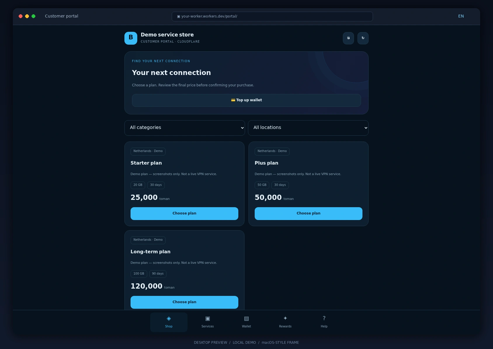
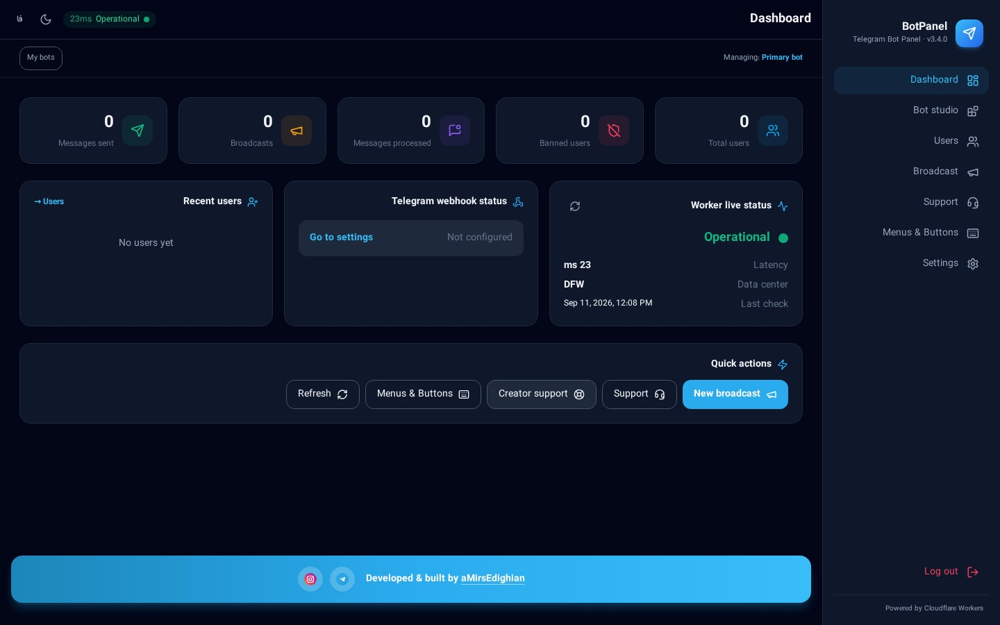

<div align="center">


# Telegram Bot Admin Panel — v3.6

**A bilingual admin panel for Telegram bots, shops, VPN/service businesses and a customer Mini App — running on Cloudflare Workers**

<a href="README.md"></a>

`This page is in English. Use the button above for the Persian version.`

</div>

> **v3.6:** Adds Remnawave/Rebecca providers and TonPay/BluPal/QubePay/Tronado funding to the existing Cloudflare-native VPN shop. See the [deployment, test evidence and limitations guide (Persian)](docs/RELEASE-3.6.fa.md). Live provider/gateway compatibility has not been certified.

---

> **How to read this page:** every section is an **accordion**. Click the **▸ arrow** next to a heading to expand its full explanation, and click again to collapse it. Each panel section is documented separately, from zero to one hundred.

<div align="center">

</div>

---

## Table of contents

| # | Section | Topic |
|---|---------|-------|
| 1 | [At a glance](#1-at-a-glance) | What the bot does |
| 2 | [Requirements](#2-requirements) | What you need first |
| 3 | [Zero-to-one-hundred setup](#3-zero-to-one-hundred-setup) | From BotFather to deployment |
| 4 | [First login and hardening](#4-first-login-and-hardening) | Private password and sessions |
| 5 | [Connecting the bot](#5-connecting-the-bot) | Token, webhook, username |
| 6 | [Panel sections, one by one](#6-panel-sections-one-by-one) | Every screen explained |
| 7 | [Customer Mini App](#7-customer-mini-app) | The shop inside Telegram |
| 8 | [The bot as your users see it](#8-the-bot-as-your-users-see-it) | Commands and button behaviour |
| 9 | [Backups, reports and security](#9-backups-reports-and-security) | Maintenance |
| 10 | [Development and testing](#10-development-and-testing) | For contributors |
| 11 | [Screenshot gallery](#11-screenshot-gallery) | Every screen |
| 12 | [Troubleshooting](#12-troubleshooting) | Common errors |
| 13 | [Creator and contact](#13-creator-and-contact) | aMirsEdighian |

---

## 1. At a glance

<details open>
<summary><b>▸ What is this project and what does it do?</b></summary>

BotPanel is a **complete admin panel for Telegram bots** that runs on **Cloudflare Workers** — no rented server, no Docker, no separate database and no static IP. The whole system boots inside one Worker backed by a **Durable Object (SQLite)**.

A single installation gives you:

- **Bot management:** menus, inline buttons, sub-menus, start and help texts, fully bilingual (Persian/English).
- **Users:** list, search, block, tags and statistics.
- **Broadcasting:** text, photo, polls, delivery to users or channels, a queued sender and delivery reports.
- **Shop:** products, orders, bank-transfer receipts, discount codes, automatic file delivery.
- **Service / VPN:** Marzban / Marzneshin and other providers, plans, ready-made config stock, renewals, wallets, resellers.
- **Customer Mini App:** shop and account area inside Telegram, including a **live support chat**.
- **Support desk:** customer tickets inside the panel; an admin reply lands in the Mini App *and* in the customer's Telegram chat.
- **Loyalty:** points, spin wheel, raffles, dice and gifts.
- **Groups:** rules, anti-link, forward stripping, welcome messages and member moderation.
- **Multi-bot:** run several independent bots from one panel.

</details>

<details>
<summary><b>▸ Technical architecture in one table</b></summary>

| Layer | Technology | Note |
|-------|------------|------|
| Runtime | Cloudflare Workers | Serverless, runs at the edge |
| Routing | Hono | Everything under `/api` |
| Storage | Durable Object with SQLite | Class `BotCoordinator` |
| Migration source | KV (`BOT_KV`) | Read-only, for legacy data |
| UI | Plain HTML/CSS/JS + Tailwind (built locally) | No external CDN at runtime |
| Scheduling | Cron every minute | Queued broadcasts, renewals, reminders |
| Mini App | Telegram WebApp | Served from `/portal` |

Key files: `src/index.js` (routes), `src/telegram.js` (bot logic), `src/services/` (service/VPN module), `public/` (panel and Mini App).

</details>

<details open>
<summary><b>▸ What's new in v3.5</b></summary>

- **Live Iran market rates:** the rates section now merges several layers of live sources (gold/coins, free-market fiat, Tether & crypto) with a one-minute cache and automatic Rial/Toman normalization. Iranian market feeds come first (TGJU through its small `api.tgju.org` service, Bonbast, Nobitex, TetherLand, SwapWallet), then global key-free feeds (CoinGecko and Kraken for crypto in USD, gold-api for the gold ounce, world FX and the `rate-json` Toman feed), and finally the public reference pages (moj3.ir, alanchand.com, isignal.ir). Rows no live feed answered for are calculated from the live references of that moment and tagged *derived*, so the table still updates when one or more sources are unreachable. The panel shows a per-source status list (✔/✘ with the error reason and latency) and the same report is available at `GET /api/rates/sources`; only when every source is down are the last good rates served with a *stale* warning. A live table renders inside the panel (**Settings → Rates section**) and is also exposed at `GET /api/rates/live`.
- **PasarGuard panel type in Services/VPN:** a new `PasarGuard` provider next to Marzban/Marzneshin, speaking the standard Marz-family REST API with service-group (`group_ids`) support.
- **Webhook reminder:** after saving the bot token and numeric admin ID, the panel shows a banner + modal reminding you to press **Set webhook** in **Settings → Webhook management** — without it, Telegram delivers nothing and the bot stays silent.
- **Brand icons instead of emojis:** every emoji in the admin panel and customer mini-app is replaced with brand icons (Lucide on web, bundled inline SVG in the mini-app).
- **Fully responsive:** the admin panel and mini-app work from phones to desktops with no horizontal scrolling; modals open as bottom sheets on small phones.
- **Accordions collapsed by default:** every collapsible section stays closed until clicked.

</details>

<details>
<summary><b>▸ What's new in v3.4</b></summary>

- **Nation-wide news publisher (Iran + world):** one 📰 button after `/start`, then a choice between **Iran news** and **world news**; each opens its own categories (breaking, politics, economy, sports, tech). World headlines are **automatically translated to Persian** (30-day cache). Schedule delivery to channels/groups by a **fixed daily time** (Tehran) or a repeating interval.
- **Clean custom/default bots:** a bot whose purpose is *Default/Custom* starts with **no buttons at all** until the admin adds buttons in *Menus & Buttons*; no system default buttons are shown, and an explicitly saved empty button list stays empty.
- **One-button rates bot:** the rates purpose opens with a single **📈 USD, gold & Tether** button, then the asset categories; live table with 24h change, send-now, and a **daily scheduled publish** (asset type + Tehran time + destinations).
- **Full `/admin` inside Telegram:** every control that exists in the web panel is available to the admin as glass buttons — stats, news, rates, menus & buttons, shop, broadcast, media, locks, webhook, tuning, services, tokens and more. Tapping a button **edits the same message in place** and reveals the next options; no new messages are stacked.
- **Password on every panel entry:** the panel session no longer persists in localStorage; the password is required on every new tab/window or browser restart (Telegram mini-app login is unaffected).
- **Regenerable screenshots:** run `npm run screenshots` to capture every README image from a fresh local build.

</details>

---

## 2. Requirements

<details>
<summary><b>▸ What you need before you start</b></summary>

| Item | Why | Required? |
|------|-----|-----------|
| **Node.js 22.16+** | Building and running locally | Yes |
| **Cloudflare account** | Workers and Durable Objects | Yes |
| **Bot token** | From [@BotFather](https://t.me/BotFather) | Yes |
| **Git** | To clone the source | Yes |
| **A media channel/group** | For direct file uploads | Optional |
| **Payment gateway** | ZarinPal, Telegram Stars, crypto | Optional |
| **VPN provider panel** | Marzban / Marzneshin, etc. | Service mode only |

Check your Node version:

```bash
node -v   # must be 22.16.0 or newer
```

</details>

---

## 3. Zero-to-one-hundred setup

<div align="center">

</div>

<details>
<summary><b>▸ Step 1 — Create the bot in BotFather</b></summary>

1. Open [@BotFather](https://t.me/BotFather) in Telegram and send `/newbot`.
2. Pick a **display name**, then a **username** ending in `bot`.
3. You receive a token such as `123456789:AAE...`. Store it safely and **never commit it to Git**.
4. Optional but useful:
   - `/setdescription` and `/setabouttext` to introduce the bot.
   - `/setuserpic` for the avatar.
   - `/setprivacy` → **Disable** it if the bot must read all group messages.
   - `/setmenubutton` → you can point this at the Mini App later.

</details>

<details>
<summary><b>▸ Step 2 — Clone the source and install dependencies</b></summary>

```bash
git clone https://github.com/amirsedighian071-stack/telegram-bot-panel-v2.git
cd telegram-bot-panel-v2
npm ci
```

`npm ci` installs the exact versions locked in `package-lock.json`, so your build matches the tested one.

Then build the static UI assets:

```bash
npm run build
```

This produces CSS, fonts and icons locally inside `public/`, so the panel never depends on an external CDN at runtime.

</details>

<details>
<summary><b>▸ Step 3 — Log in to Cloudflare and review wrangler.toml</b></summary>

```bash
npx wrangler login
```

Open `wrangler.toml`. These blocks are **mandatory**:

```toml
name = "telegram-bot-panel-v2"
main = "src/index.js"

[[durable_objects.bindings]]
name = "BOT_STATE"
class_name = "BotCoordinator"

[[migrations]]
tag = "v2-durable-state"
new_sqlite_classes = ["BotCoordinator"]

[triggers]
crons = ["* * * * *"]
```

- `name` is your Worker name. If you already run another deployment, choose a different name so it is not replaced.
- `BOT_STATE` is the primary data store; Cloudflare provisions it during deployment.
- `crons` powers queued broadcasts, service renewals and reminders.
- Leave the `ASSETS` and `run_worker_first` rules for `/api/*`, `/telegram/*`, `/pay/*` and `/internal/*` untouched.

**KV:** the `BOT_KV` binding is only read, to import data from older versions. For a brand-new installation create an empty namespace:

```bash
npx wrangler kv namespace create BOT_KV
```

and put the resulting id in `wrangler.toml`.

</details>

<details>
<summary><b>▸ Step 4 — Configure secrets</b></summary>

```bash
npx wrangler secret put WEBHOOK_SECRET
npx wrangler secret put BOT_TOKEN
```

| Name | Purpose | Notes |
|------|---------|-------|
| `WEBHOOK_SECRET` | Signs incoming Telegram requests | Random 32-char string of letters, digits, `_`, `-` — **required** |
| `BOT_TOKEN` | Bot token | Can also be saved from inside the panel, which takes precedence |
| `VAULT_KEY` | Encrypts VPN provider and gateway credentials | Required for the service module (32 characters) |
| `ADMIN_PASSWORD` | Fallback login password | Optional; a password stored in the panel wins |
| `BACKUP_PASSWORD` | Encrypts backup archives | Optional |

Generate a safe random value:

```bash
node -e "console.log(require('crypto').randomBytes(24).toString('base64url'))"
```

> ⚠️ Never place these values in source code, `wrangler.toml` or a commit.

</details>

<details>
<summary><b>▸ Step 5 — Run locally before publishing</b></summary>

```bash
npm run dev
```

The panel starts on `http://127.0.0.1:8787`. Locally you can review the layout, menus and settings. Real Telegram traffic needs a public URL, so full bot testing happens after deployment.

Run the automated tests:

```bash
npm test
```

</details>

<details>
<summary><b>▸ Step 6 — Deploy to Cloudflare</b></summary>

```bash
npm run deploy
```

To inspect the output without publishing:

```bash
npm run build
npx wrangler deploy --dry-run
```

You end up with a URL such as `https://telegram-bot-panel-v2.<subdomain>.workers.dev`. That single URL is both the admin panel and the webhook target.

If you use **Cloudflare's Git integration**, make sure it follows this repository and the `main` branch, and that the secrets exist in that environment.

</details>

---

## 4. First login and hardening

<div align="center">

</div>

<details>
<summary><b>▸ Signing in with the default password and creating a private one</b></summary>

1. Open the Worker URL in a browser.
2. On a fresh installation the initial password is **`botpanel123`** — no environment variable required.
3. Immediately after login the panel shows the **create a private password** form. A default-password session can reach nothing else until the password is changed.
4. Save the new password. All previous sessions are invalidated and only the new password works.

> 🔒 The default password is public knowledge, so complete this step **right after your first deployment**. For extra safety you can put the first release behind Cloudflare Access.

Later password changes happen in **Settings → Security**.

> 🔐 **Password on every entry (v3.4):** the panel session lives in the tab's temporary storage (sessionStorage), not in the browser's persistent storage. Opening the panel in a new tab or window — or restarting the browser — always asks for the password again. Admin login inside Telegram still works without a password via `initData` verification.

</details>

---

## 5. Connecting the bot

<details>
<summary><b>▸ Saving the token, testing the connection, registering the webhook</b></summary>

1. Go to **Settings → Bot settings** and paste the BotFather token.
2. Choose the bot language: Persian only, English only, or bilingual (the user picks).
3. In **Settings → Webhook management**, press **Set webhook**. This registers the Worker URL, the `WEBHOOK_SECRET` and every update type the panel needs, including `chat_member` and `channel_post`.
4. The webhook status box shows the current state; if it reports a last error, verify the URL and the secret.
5. Send `/start` to the bot from a test account. A reply means everything is wired up.

> ⚠️ A Telegram token can only have **one active webhook**. Registering it here stops any other service that used the same token.

**Groups:** make the bot an administrator with delete-message and restrict permissions. If it must see every group message, disable Privacy Mode in BotFather.

</details>

---

## 6. Panel sections, one by one

> Every subsection below is documented **separately and completely**. Click the ▸ arrow.

### 6.1 Dashboard

<details>
<summary><b>▸ Dashboard — the pulse of your bot</b></summary>

**What you see:**

- Total users, users active today, new users.
- Bot health: token, webhook and username status.
- Recent broadcasts and their delivery rate.
- Unread support tickets.
- Sales/service summaries when those modules are enabled.

**How to use it:**

1. You land here automatically after logging in.
2. The cards are clickable and take you to the matching section.
3. A zero simply means the related module has not been enabled or used yet.

**Note:** all numbers come from live SQLite data; no manual refresh loop is needed.

</details>

### 6.2 Bot Studio

<div align="center">

</div>

<details>
<summary><b>▸ Overview and choosing the bot purpose</b></summary>

The Studio is where the bot is built. Your first decision is the **bot purpose**:

| Purpose | Best for |
|---------|----------|
| Shop | Selling digital or physical products |
| Service / VPN | Selling and renewing configs or accounts |
| Channel owner | Scheduled publishing and member management |
| Group moderation | Rules, anti-link, welcome messages |
| FAQ | A question-and-answer bot |
| Education | Courses with progress tracking |
| Custom | Tick the exact modules you want |

**How to use it:**

1. Open **Bot Studio → Overview**.
2. Click the card you want; the selected card gets a coloured border.
3. Press **Save**. The tab bar now shows only the relevant tabs.
4. In **Custom** mode a module checklist appears — enable exactly what you need.

**Important:** changing the purpose never deletes data; it only changes which tabs are visible.

</details>

<details>
<summary><b>▸ Catalog (products)</b></summary>

**Purpose:** define digital or physical products for sale inside the bot.

**Step by step:**

1. **Bot Studio → Catalog → Add product**.
2. Fill in title, description, price and image.
3. For a free product set the price to `0`; the button becomes “Get” instead of “Buy”.
4. In **Delivery**, define the file or text the customer receives after payment.
5. Use the **product deep link** to sell straight from a channel post.

**Note:** if a channel lock is active, the customer must join first; the purchase then resumes automatically.

</details>

<details>
<summary><b>▸ Orders and receipts</b></summary>

**Purpose:** track purchases and approve bank-transfer payments.

**Step by step:**

1. **Bot Studio → Orders** lists every order with its state: pending, receipt review, paid, rejected.
2. For bank transfers, the customer's receipt photo is shown inline.
3. **Approve** delivers the product instantly and marks the order paid.
4. **Reject** asks for a reason, which is forwarded to the customer.

**Note:** if the buyer leaves a required channel after ordering, delivery is held until they rejoin.

</details>

<details>
<summary><b>▸ Discount codes</b></summary>

1. **Bot Studio → Discounts → New code**.
2. Set the code (e.g. `WELCOME20`), the type (percentage or fixed amount), a usage cap and an expiry date.
3. Optionally restrict the code to a single product or plan.
4. The customer enters the code at checkout and the price updates immediately.

</details>

<details>
<summary><b>▸ Scheduled channel publishing</b></summary>

1. Make the bot an administrator of the channel.
2. Open **Bot Studio → Publishing** and enter the channel id.
3. Compose the post, attach media and buttons, and pick a **publish time**.
4. The one-minute cron checks the queue and posts on schedule.
5. The publish history with success/failure state lives in the same tab.

</details>

<details>
<summary><b>▸ Group moderation</b></summary>

1. Add the bot to the group as an **administrator with delete and restrict rights**.
2. The group appears under **Bot Studio → Groups** but stays **off until you enable it manually**.
3. Per group you can enable: welcome messages, anti-link, anti-spam, removal of other channels' posts, word filters and a night lock.
4. Violations are counted; once the threshold is crossed the bot warns or mutes.

</details>

<details>
<summary><b>▸ Relay (forward stripping)</b></summary>

This tool republishes a source channel's posts in a destination **without the “forwarded from” label**.

1. Make the bot an admin in both the source and destination channels.
2. Define the pair in the **Relay** tab.
3. Optionally add replacement text, a signature or custom buttons.

</details>

<details>
<summary><b>▸ Loyalty club (points and rewards)</b></summary>

1. Open the **Loyalty** tab and set the points for each event: joining, purchasing, inviting a friend, daily activity.
2. Define tiers (bronze, silver, gold …) and the reward per tier.
3. Customers see their points and tier in the bot and in the Mini App.
4. Prize mechanics such as the spin wheel and raffles are configured in **Service → Rewards**.

</details>

<details>
<summary><b>▸ FAQ</b></summary>

1. **FAQ tab → Add question**.
2. Write the question and answer (for both languages if the bot is bilingual).
3. Control the display order.
4. In the bot the user sees the question list, and selecting one **edits the same message** to show the answer instead of sending a new message.

</details>

<details>
<summary><b>▸ Media and direct uploads</b></summary>

<div align="center">

</div>

1. First configure one of these in **Settings → Files and media**:
   - the numeric id of an admin who has already started the bot, or
   - a dedicated channel/group where the bot may post (and preferably delete).
2. In the **Media** tab pick a file. It is sent to that chat, the `file_id` is stored and the temporary message is deleted.
3. The stored media can then be reused in products, channel posts and broadcasts.

**Limits:** 10 MiB for photos, 20 MiB for other files. Changing the bot token requires re-uploading media.

</details>

### 6.3 Users

<details>
<summary><b>▸ Managing users</b></summary>

**What you see:** everyone who has started the bot, with name, id, language, join date and status.

**What you can do:**

| Task | How |
|------|-----|
| Search | Type a name or numeric id in the search box |
| Block | The “Block” button on the row; the bot stops answering them |
| Unblock | The same button while blocked |
| Inspect | Click the row for orders, wallet, tickets and points |
| Direct message | Send a message straight from the detail view |
| Paginate | Next/previous buttons under the table |

**Note:** users cannot be deleted, because order history depends on them — block them instead.

</details>

### 6.4 Broadcast

<details>
<summary><b>▸ Messaging every user — step by step</b></summary>

The screen itself is built from accordions:

| Section | Purpose |
|---------|---------|
| **Audience** | All users, a custom id list, or a channel/group |
| **Text** | Text message with inline buttons |
| **Poll** | Build a poll with custom options |
| **Photo** | Photo with a caption |
| **Results** | Sent, failed and blocked counts |
| **History** | Previous broadcasts and their state |

**Step by step:**

1. Open **Audience** and choose the destination.
2. Open one of Text / Poll / Photo and compose the content.
3. Add inline buttons with a label and URL if needed.
4. Press **Send**. Delivery runs as a background queue, so you can close the page.
5. Watch progress under **Results**; users who blocked the bot are flagged automatically.

**Throughput:** batch size and delay live in **Settings → Broadcast tuning**. The defaults are safe for Telegram's rate limits.

</details>

### 6.5 Support desk

<details>
<summary><b>▸ Tickets, admin replies and the Mini App chat</b></summary>

**What you see:** the list of support conversations. Each customer has one continuous thread, with an unread counter next to their name.

**Workflow:**

1. The customer writes from the **bot's support button** or from the **Mini App support tab**.
2. The message is stored instantly in **Panel → Support** and the unread counter increases.
3. Click the thread to read the full history; opening it marks the messages as read.
4. Type your answer and press **Send**. The reply goes out **simultaneously**:
   - as a Telegram message to the customer, and
   - into their Mini App support tab.
5. **Close** archives the thread; the customer's next message reopens it.

**Related settings:**

- To pin a support button under every bot message: **Settings → Bot settings → Always show support button**.
- To be notified of new messages in a staff group: set the **report chat** in **Service → Settings**.

</details>

### 6.6 Menu and buttons

<div align="center">

</div>

<details>
<summary><b>▸ Building the menu, sub-menus and the start text</b></summary>

This screen is also accordion-based:

| Section | Purpose |
|---------|---------|
| **Start text** | The first message a user sees after `/start` |
| **Help text** | The answer to the help button/command |
| **Page buttons** | Inline buttons under the message |
| **Sub-menus** | Nested pages |

**Step by step:**

1. Open **Start text** and write the welcome message (both languages in bilingual mode).
2. Under **Page buttons**, press **Add button** to create rows. A button can:
   - open a **URL**,
   - open a **sub-menu**,
   - show **static text**, or
   - run a **built-in action** (shop, service, support, points …).
3. Arrange buttons across rows; each row holds one to three buttons.
4. Create **sub-menus** and point buttons at them; a back button is added automatically.
5. **Save** and send `/start` to the bot to see the result.

**New behaviour in v3.1:** pressing a button **edits the existing message** with the new text and buttons, so the chat never fills with duplicates. Delivered content (files, configs, receipts) is still sent as a new message so it stays in the history.

</details>

### 6.7 Settings

<div align="center">

</div>

<details>
<summary><b>▸ Bot settings (token, language, support button)</b></summary>

- **Bot token:** paste the BotFather token. The value stored here overrides the environment variable.
- **Bot language:** bilingual, Persian only, or English only. In bilingual mode the user picks on first run.
- **Default language:** the language new users get until they change it.
- **Always-on support button:** pins a support button under every bot message; provide the label per language.

Every block on this screen is an **accordion**, with an **expand/collapse all** button at the top. Each block remembers whether you left it open.

</details>

<details>
<summary><b>▸ Security (password and sessions)</b></summary>

1. Enter the current password.
2. Type the new password twice.
3. Press **Change password**; all other sessions are invalidated immediately.

If you lose the password, set the `ADMIN_PASSWORD` variable in Cloudflare and reset the stored record through it.

</details>

<details>
<summary><b>▸ Channel membership lock</b></summary>

1. Tick **Enable lock**.
2. Enter the channel id (`@channel`) and a join link.
3. Make the bot an administrator of that channel so it can verify membership.
4. Non-members see a join prompt with a **Check membership** button; once they join, their pending action (for example a product deep link) resumes automatically.

The lock can be scoped to a single area (shop, service, groups) instead of the whole bot.

</details>

<details>
<summary><b>▸ Webhook management</b></summary>

- **Set webhook:** registers the current Worker URL with the secret and required update types.
- **Delete webhook:** disconnects Telegram from this Worker (useful when moving the bot).
- ⚠️ **Important:** until you press “Set webhook”, Telegram delivers nothing and the bot stays completely silent. After saving the token and numeric admin ID, the panel reminds you with a banner and a popup.
- The status box shows the last error and the pending update count — start troubleshooting here.

</details>

<details>
<summary><b>▸ Broadcast tuning</b></summary>

- **Batch size:** messages per round (1–50).
- **Delay (ms):** pause between batches (20–500).

If you hit rate-limit (429) errors, lower the batch size and raise the delay.

</details>

<details>
<summary><b>▸ Panel preferences (theme and language)</b></summary>

- Six built-in themes: dark, light, ocean, violet, forest, sunset.
- Panel language: Persian or English, independent of the bot language.
- Your choice is stored in the browser.

</details>

### 6.8 Service / VPN

<div align="center">

</div>

<details>
<summary><b>▸ Overview and enabling the service module</b></summary>

This module sells services (VPN, subscriptions, accounts) and has 13 tabs. To start:

1. Make sure `VAULT_KEY` is configured as a secret — without it provider credentials cannot be stored.
2. In **Bot Studio → Overview** set the purpose to **Service / VPN**, or enable the “services” module in Custom mode.
3. Open **Bot Studio → Service / VPN**.

**Performance:** the workspace shell renders immediately while each tab's body loads behind it and is cached briefly, so switching tabs is instant. Any data change clears the cache automatically.

</details>

<details>
<summary><b>▸ Providers</b></summary>

1. Press **Add provider** and pick the type: Marzban, Marzneshin, **PasarGuard**, manual stock, and so on.

**PasarGuard:** choose the `PasarGuard` type and enter the panel URL plus admin username/password (standard Marz-family REST API with service groups). If a plan selects a service group, the user is created inside that group.
2. Enter the URL, username and password. Credentials are encrypted with `VAULT_KEY` and are never returned by the API.
3. Press **Test connection**; on success the provider version is displayed.
4. **Enable** the provider so it can be selected in plans.

</details>

<details>
<summary><b>▸ Plans</b></summary>

1. **New plan** → title, provider, duration (days), volume (GB), price.
2. Choose the **allowed roles**: customer, reseller, credit reseller.
3. Set the extra-GB and extra-day prices used for renewals.
4. If the plan is fulfilled from stock, select the **stock shelf**.
5. A saved plan is immediately purchasable in the bot and the Mini App.

</details>

<details>
<summary><b>▸ Stock</b></summary>

For selling ready-made configs:

1. Create a **shelf** (e.g. “Germany 30 days”).
2. Use **bulk import** to paste configs line by line.
3. Inventory is shown live and one item is consumed per sale.
4. Low stock raises a warning on the overview tab.

</details>

<details>
<summary><b>▸ Services (active subscriptions)</b></summary>

Every sold service with its owner, plan, expiry date and usage.

- **Inspect:** subscription link, traffic usage and status.
- **Manual renewal:** add days or volume without a payment.
- **Suspend/resume:** temporarily disable a service.
- **Delete:** only once it is also removed from the provider.

</details>

<details>
<summary><b>▸ Operations</b></summary>

Every purchase, renewal or change creates an “operation”. If the provider connection drops mid-flight the operation stays *uncertain* and the system **reconciles** it automatically so no duplicate service is created. From this tab you can inspect or retry unfinished operations.

</details>

<details>
<summary><b>▸ Wallets</b></summary>

- Each customer's balance plus deposit and spend history.
- **Manual credit/debit** with a mandatory reason (for support and compensation).
- Credit limits for credit resellers.

</details>

<details>
<summary><b>▸ Payments and gateways</b></summary>

Supported methods:

| Method | Notes |
|--------|-------|
| Bank transfer | The customer uploads a receipt, an admin approves it |
| ZarinPal | Online IRR payments |
| Telegram Stars | In-app Telegram payments |
| Crypto (TON/TRON — USDT) | Automatic transaction verification |

Enter each gateway's keys in this tab; sensitive values are stored encrypted. Transactions are listed with their state (pending, verified, failed).

</details>

<details>
<summary><b>▸ Requests</b></summary>

Requests that need a human decision: reseller upgrades, credit increases, config replacements and refunds. Each row has **Approve** and **Reject**, and the customer is notified instantly.

</details>

<details>
<summary><b>▸ Promotions</b></summary>

Service-specific discount codes, wallet gift codes and referral campaigns. Each code supports a usage cap, an expiry date and plan restrictions.

</details>

<details>
<summary><b>▸ Rewards (wheel, raffle, dice)</b></summary>

- **Spin wheel:** define prizes and odds, plus a daily budget and a cooldown between spins.
- **Raffle:** tickets accumulate from purchases or activity, and the winner is drawn and announced automatically.
- **Dice:** a quick gift that can be limited to customers with no prior purchase or to a specific role.

</details>

<details>
<summary><b>▸ Service settings</b></summary>

- **Brand:** shop name (Persian/English), accent colour and logo — all visible in the Mini App.
- **Rules:** the terms text and its version; bumping the version asks customers to accept again.
- **Phone number:** require a phone number and optionally restrict it to Iranian numbers.
- **Report chat:** the group or channel that receives important events (purchases, support messages, errors).
- **Maintenance mode:** pause purchases with a custom message.

</details>

<details>
<summary><b>▸ Reports and backup</b></summary>

- **Excel/CSV exports** for sales, services, wallets and customers.
- **Full backup** as an encrypted archive (using `BACKUP_PASSWORD`).
- **Restore** from a backup file — always take a fresh backup before restoring.

</details>

### 6.9 My bots (multi-bot)

<details>
<summary><b>▸ Running several bots from one panel</b></summary>

1. In **My bots**, add a new bot with its token.
2. Each bot receives a fully independent data space (its own Durable Object), so users, products and settings never mix.
3. Register each bot's webhook from the same screen.
4. Selecting a bot switches the whole panel to that bot's data.

</details>

---

## 7. Customer Mini App

<div align="center">

</div>

<details>
<summary><b>▸ What the Mini App is and how to enable it</b></summary>

The Mini App is the graphical shop and account area that opens **inside Telegram** at `https://<your Worker URL>/portal`.

**Enabling it:**

1. In **Service → Settings**, fill in the **public URL** with your Worker address.
2. In BotFather run `/setmenubutton` and point it at `/portal`, or add a WebApp button to the bot menu.
3. Customers tap the button and enter the shop without leaving Telegram; their identity is verified through Telegram `initData`, so no extra password is needed.

</details>

<details>
<summary><b>▸ Mini App tabs</b></summary>

| Tab | Purpose |
|-----|---------|
| Home | Account summary, balance, active services |
| Shop | Buy a plan, apply a discount code |
| My services | Subscription link, usage, renewals |
| Wallet | Top-ups and transaction history |
| Rewards | Wheel, raffle, points |
| Help & support | Written guide plus a live support chat |

</details>

<details>
<summary><b>▸ In-app support chat (rebuilt)</b></summary>

The support button used to simply throw the customer out of the Mini App and into the bot chat. Now:

1. The customer opens **Help → Chat with support** and sees the whole conversation history.
2. They write and send a message right there (up to 2000 characters, limited to 10 messages per minute to prevent spam).
3. The message appears instantly in **Panel → Support**, and if a **report chat** is configured the staff group is notified too.
4. The admin's reply arrives **both in that chat thread and as a Telegram message**.
5. Unread replies show as a red badge on the Help tab, which clears when the thread is opened.
6. The view refreshes every 12 seconds, so answers appear without a manual reload.

If the support module is disabled, the customer sees a clear “support is not enabled” message.

</details>

---

## 8. The bot as your users see it

<details>
<summary><b>▸ Commands and button behaviour</b></summary>

| Command | Result |
|---------|--------|
| `/start` | Welcome message and main menu |
| `/start p_<id>` | Jump straight to a product page (deep link) |
| `/help` | Help text |
| `/lang` | Switch language (bilingual mode) |
| `/news` or `/khabar` | Nation-wide news: Iran news and world news (translated to Persian), by category |
| `/rates`, `/price`, `/gold`, `/dollar`, `/arz` | Live gold, USD, Tether, coin and crypto prices |
| `/admin` or `/panel` | The full glass admin panel inside Telegram for the owner (every panel section, edited in place) |
| Support button | Opens a conversation with the admins |

**Button behaviour (v3.1+):**

- Tapping an inline button **edits the same message** with new text and buttons, so the chat stays clean.
- Delivered content (files, configs, receipts, payment notices) is still sent as a new message so it remains in the chat history.
- If the original message cannot be edited (too old, or media-based), the bot silently falls back to sending a new message — the user never sees an error.

</details>

---

## 9. Backups, reports and security

<details>
<summary><b>▸ Routine maintenance</b></summary>

| Task | Frequency | Where |
|------|-----------|-------|
| Full backup | Weekly | Service → Reports & backup |
| Sales Excel export | Monthly | Service → Reports & backup |
| Webhook health check | Monthly | Settings → Webhook management |
| Rotate the panel password | Periodically | Settings → Security |
| Review error logs | Weekly | `npx wrangler tail` |

**Security notes:**

- Change the default password on day one.
- Never commit the bot token or gateway keys.
- Keep the media storage chat private.
- Do not rotate `VAULT_KEY` without a migration plan — previously encrypted data becomes unreadable.

</details>

---

## 10. Development and testing

<details>
<summary><b>▸ Useful commands and project layout</b></summary>

```bash
npm ci                 # exact dependency install
npm run build          # build CSS and static assets
npm run dev            # local run on 127.0.0.1:8787
npm test               # unit and integration tests
npm run test:ui        # browser tests (requires Playwright)
npm run deploy         # deploy to Cloudflare
npx wrangler tail      # live logs
```

**Folder layout:**

```
src/
  index.js         API routes and the Durable Object
  telegram.js      Bot logic (messages, buttons, message editing)
  bot-api.js       Telegram API client
  kv.js            Data model and support tickets
  routes/          Panel routes (users, support, settings …)
  services/        Service/VPN module and Mini App API
public/
  index.html       Panel shell
  panel.js         UI core
  studio.js        Bot Studio
  services.js      Service administration
  portal/          Customer Mini App
tests/             Test suite
```

</details>

---

## 11. Screenshot gallery

<details open>
<summary><b>▸ Every screen at a glance</b></summary>

<div align="center">





</div>

</details>

---

## 12. Troubleshooting

<details>
<summary><b>▸ Common problems and fixes</b></summary>

| Problem | Likely cause | Fix |
|---------|--------------|-----|
| The bot does not reply | Webhook not registered | Settings → Webhook management → Set webhook |
| 401 errors in the panel | Session expired | Log out and back in |
| “Invalid token” | Wrong or revoked token | Get a fresh token from BotFather and save it |
| Uploads fail | No storage chat configured | Settings → Files and media |
| Membership is never verified | Bot is not a channel admin | Promote the bot |
| Broadcasts are slow | Telegram rate limits | Lower the batch size, raise the delay |
| Provider credentials are not saved | `VAULT_KEY` missing | Add the secret and redeploy |
| The Mini App will not open | Public URL is empty | Service → Settings → Public URL |
| Support messages are not stored | Support module disabled | Check the bot purpose / custom modules |

For the exact server-side error:

```bash
npx wrangler tail
```

</details>

---

## 13. Creator and contact

<div align="center">


### Built and maintained by **aMirsEdighian**

For support, custom development or bug reports, click a logo:

<a href="https://t.me/developer_as"></a>
&nbsp;&nbsp;
<a href="https://instagram.com/x.amirrezaa1"></a>

| Channel | Handle | Link |
|---------|--------|------|
| Telegram | `developer_as` | [t.me/developer_as](https://t.me/developer_as) |
| Instagram | `x.amirrezaa1` | [instagram.com/x.amirrezaa1](https://instagram.com/x.amirrezaa1) |

<a href="README.md"></a>

</div>
