<div align="center">


# پنل مدیریت ربات تلگرام — نسخه ۳٫۵

**پنل فارسی/انگلیسی مدیریت ربات تلگرام، فروشگاه، سرویس VPN و مینی‌اپ مشتری — روی Cloudflare Workers**

<a href="README.en.md"></a>

`این صفحه فارسی است. برای نسخه انگلیسی روی دکمه بالا بزنید.`

</div>

---

> **راهنمای استفاده از این صفحه:** تمام بخش‌ها به‌صورت **آکاردئونی** نوشته شده‌اند. روی **فلش ▸** کنار عنوان هر بخش کلیک کنید تا توضیح کامل آن باز شود و دوباره کلیک کنید تا بسته شود. هر بخش پنل جداگانه و از صفر تا صد توضیح داده شده است.

<div align="center">

</div>

---

## فهرست

| # | بخش | موضوع |
|---|-----|-------|
| ۱ | [یک نگاه کلی](#۱-یک-نگاه-کلی) | ربات چه کاری انجام می‌دهد |
| ۲ | [پیش‌نیازها](#۲-پیش‌نیازها) | چه چیزهایی لازم دارید |
| ۳ | [نصب و راه‌اندازی صفر تا صد](#۳-نصب-و-راهاندازی-صفر-تا-صد) | از BotFather تا استقرار |
| ۴ | [اولین ورود و امن‌سازی](#۴-اولین-ورود-و-امنسازی) | رمز خصوصی و نشست‌ها |
| ۵ | [اتصال ربات به پنل](#۵-اتصال-ربات-به-پنل) | توکن، وب‌هوک، یوزرنیم |
| ۶ | [راهنمای بخش‌های پنل](#۶-راهنمای-بخشهای-پنل) | هر بخش، جداگانه |
| ۷ | [مینی‌اپ مشتری](#۷-مینیاپ-مشتری) | فروشگاه داخل تلگرام |
| ۸ | [ربات از نگاه کاربر](#۸-ربات-از-نگاه-کاربر) | دستورها و رفتار دکمه‌ها |
| ۹ | [پشتیبان‌گیری، گزارش و امنیت](#۹-پشتیبانگیری-گزارش-و-امنیت) | نگهداری |
| ۱۰ | [توسعه و تست](#۱۰-توسعه-و-تست) | برای برنامه‌نویس‌ها |
| ۱۱ | [گالری تصاویر](#۱۱-گالری-تصاویر) | نمای بخش‌ها |
| ۱۲ | [عیب‌یابی](#۱۲-عیبیابی) | خطاهای رایج |
| ۱۳ | [سازنده و راه‌های ارتباط](#۱۳-سازنده-و-راههای-ارتباط) | aMirsEdighian |

---

## ۱. یک نگاه کلی

<details open>
<summary><b>▸ این پروژه چیست و چه می‌کند؟</b></summary>

<div dir="rtl">

BotPanel یک **پنل مدیریت کامل برای ربات تلگرام** است که روی **Cloudflare Workers** اجرا می‌شود؛ یعنی سرور اجاره‌ای، داکر، دیتابیس جداگانه یا IP ثابت لازم ندارید. کل سیستم داخل یک Worker با ذخیره‌سازی **Durable Object (SQLite)** بالا می‌آید.

با یک بار نصب، این امکانات را در اختیار دارید:

- **مدیریت ربات:** منو، دکمه‌های شیشه‌ای، زیرمنو، متن استارت و راهنما، دو زبانه (فارسی/انگلیسی).
- **کاربران:** لیست، جست‌وجو، مسدودسازی، برچسب و آمار.
- **ارسال همگانی:** متن، عکس، نظرسنجی، ارسال به کاربران یا کانال، صف زمان‌بندی‌شده و گزارش تحویل.
- **فروشگاه:** محصول، سفارش، رسید کارت‌به‌کارت، کد تخفیف، تحویل خودکار فایل.
- **سرویس و VPN:** اتصال به پنل‌های Marzban/Marzneshin/سایر، پلن‌ها، انبار کانفیگ آماده، تمدید، کیف پول، نمایندگی.
- **مینی‌اپ مشتری:** فروشگاه و پنل کاربری داخل خود تلگرام، همراه **گفتگوی پشتیبانی زنده**.
- **پشتیبانی:** تیکت‌های کاربران در پنل، پاسخ مدیر هم در مینی‌اپ و هم در چت تلگرام کاربر.
- **باشگاه مشتریان:** امتیاز، گردونه شانس، قرعه‌کشی، تاس و هدیه.
- **گروه‌ها:** قوانین، ضدلینک، حذف فوروارد، خوش‌آمدگویی و مدیریت اعضا.
- **چند ربات:** مدیریت چند ربات مستقل از یک پنل.

</div>

</details>

<details>
<summary><b>▸ تازه‌های نسخه ۳٫۵</b></summary>

<div dir="rtl">

- **نرخ زنده بازار ایران:** بخش قیمت نرخ طلا، سکه، ارز و رمزارز را در چند لایه از منابع زنده می‌گیرد و با هم ترکیب می‌کند: اول منابع بازار ایران (TGJU از طریق سرویس سبک `api.tgju.org`، بون‌بست، نوبیتکس، تترلند و SwapWallet)، بعد منابع جهانی بدون کلید (کوین‌گکو و کراکن برای نرخ دلاری رمزارز، gold-api برای انس طلا، نرخ‌های جهانی ارز و فید `rate-json` برای دلار/یورو/درهم به تومان) و در آخر صفحه‌های عمومی مرجع بازار ایران — moj3.ir، alanchand.com و isignal.ir. هر عدد پیش از ثبت با واحد اعلامی همان منبع (تومان/ریال) و بازهٔ معقولِ آن دارایی سنجیده می‌شود. ردیف‌هایی که هیچ منبع لحظه‌ای پاسخ نداده باشد از منابع زندهٔ همان لحظه محاسبه (مثلاً انس جهانی × دلار زنده) و با برچسب «محاسبه‌شده» نشان داده می‌شوند، بنابراین جدول در دسترس نبودن یک یا چند منبع همچنان تازه می‌ماند. کش یک‌دقیقه‌ای، تبدیل خودکار ریال/تومان، فهرست وضعیت هر منبع (✔/✘ با علت خطا و تأخیر) در پنل و در `GET /api/rates/sources`، و فقط در صورت قطع همهٔ منابع، آخرین نرخ ذخیره‌شده با برچسب «قدیمی» نمایش داده می‌شود. جدول زنده داخل پنل (**تنظیمات ← بخش قیمت**) هم دیده می‌شود و از `GET /api/rates/live` هم در دسترس است.
- **پنل PasarGuard در ماژول سرویس/VPN:** نوع جدید `PasarGuard` کنار Marzban/Marzneshin اضافه شد؛ با API استاندارد خانواده Marzban کار می‌کند و گروه‌های سرویس (group_ids) را هم پشتیبانی می‌کند.
- **هشدار ثبت وب‌هوک:** بعد از ثبت توکن ربات و آیدی عددی مدیر، پنل با بنر و پنجره یادآوری می‌کند که حتماً در **تنظیمات ← مدیریت وب‌هوک** دکمه «ثبت وب‌هوک» را بزنید؛ تا وب‌هوک ثبت نشود ربات پیامی دریافت نمی‌کند و کار نمی‌کند.
- **آیکون‌های برند به‌جای ایموجی:** همه ایموجی‌های پنل مدیریت و مینی‌اپ مشتری با آیکون‌های برند (Lucide در پنل + آیکون داخلی در مینی‌اپ) جایگزین شدند.
- **کاملاً ریسپانسیو:** پنل مدیریت و مینی‌اپ روی موبایل، تبلت و دسکتاپ بدون اسکرول افقی کار می‌کنند؛ مودال‌ها در گوشی به شکل «برگه پایینی» باز می‌شوند.
- **آکاردئون‌های بسته به‌صورت پیش‌فرض:** همه بخش‌های جمع‌شونده پنل تا زمان کلیک بسته می‌مانند تا صفحه خلوت بماند.

</div>

</details>

<details>
<summary><b>▸ معماری فنی در یک نگاه</b></summary>

<div dir="rtl">

| لایه | فناوری | نکته |
|------|---------|------|
| اجرا | Cloudflare Workers | بدون سرور، اجرا در لبه شبکه |
| مسیرها | Hono | همه APIها زیر `/api` |
| داده | Durable Object با SQLite | کلاس `BotCoordinator` |
| مهاجرت داده | KV (`BOT_KV`) | فقط برای خواندن داده نسخه‌های قبلی |
| رابط کاربری | HTML/CSS/JS خالص + Tailwind (بیلد محلی) | بدون CDN خارجی |
| زمان‌بندی | Cron هر دقیقه | ارسال‌های صف‌شده، تمدیدها، یادآوری‌ها |
| مینی‌اپ | Telegram WebApp | مسیر `/portal` |

فایل‌های مهم: `src/index.js` (مسیرها)، `src/telegram.js` (منطق ربات)، `src/services/` (سرویس/VPN)، `public/` (پنل و مینی‌اپ).

</div>

</details>

---

## ۲. پیش‌نیازها

<details>
<summary><b>▸ چه چیزهایی قبل از شروع لازم دارید</b></summary>

<div dir="rtl">

| مورد | توضیح | اجباری؟ |
|------|--------|---------|
| **Node.js 22.16+** | برای بیلد و اجرای محلی | بله |
| **حساب Cloudflare** | با دسترسی Workers و Durable Objects | بله |
| **توکن ربات** | از [@BotFather](https://t.me/BotFather) | بله |
| **گیت** | برای دریافت سورس | بله |
| **کانال/گروه رسانه** | برای آپلود مستقیم فایل | اختیاری |
| **درگاه پرداخت** | زرین‌پال، استارز تلگرام، کریپتو | اختیاری |
| **پنل VPN** | Marzban / Marzneshin و … | فقط برای حالت سرویس |

نسخه Node را بررسی کنید:

```bash
node -v   # باید 22.16.0 یا بالاتر باشد
```

</div>

</details>

---

## ۳. نصب و راه‌اندازی صفر تا صد

<div align="center">
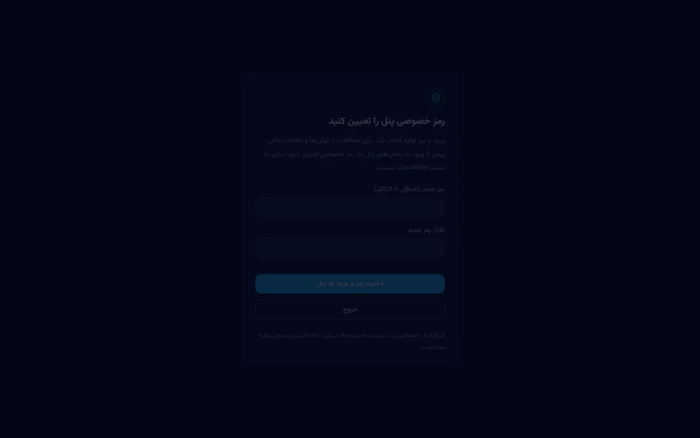
</div>

<details>
<summary><b>▸ گام ۱ — ساخت ربات در BotFather</b></summary>

<div dir="rtl">

1. در تلگرام [@BotFather](https://t.me/BotFather) را باز کنید و `/newbot` بفرستید.
2. یک **نام نمایشی** و سپس یک **یوزرنیم** که به `bot` ختم می‌شود انتخاب کنید.
3. توکنی مثل `123456789:AAE...` دریافت می‌کنید؛ آن را جایی امن نگه دارید. **هرگز آن را در گیت کامیت نکنید.**
4. اختیاری اما مفید:
   - `/setdescription` و `/setabouttext` برای معرفی ربات.
   - `/setuserpic` برای عکس ربات.
   - `/setprivacy` → اگر ربات باید پیام‌های گروه را ببیند، **Disable** کنید.
   - `/setmenubutton` → بعداً می‌توانید دکمه مینی‌اپ را اینجا هم ثبت کنید.

</div>

</details>

<details>
<summary><b>▸ گام ۲ — دریافت سورس و نصب وابستگی‌ها</b></summary>

<div dir="rtl">

```bash
git clone https://github.com/amirsedighian071-stack/telegram-bot-panel-v2.git
cd telegram-bot-panel-v2
npm ci
```

`npm ci` دقیقاً نسخه‌های قفل‌شده در `package-lock.json` را نصب می‌کند و از تفاوت نسخه‌ها جلوگیری می‌کند.

سپس فایل‌های ثابت رابط کاربری را بسازید:

```bash
npm run build
```

این دستور CSS، فونت و آیکون‌ها را به‌صورت محلی داخل `public/` می‌سازد تا پنل در زمان اجرا به هیچ CDN خارجی وابسته نباشد.

</div>

</details>

<details>
<summary><b>▸ گام ۳ — ورود به Cloudflare و بررسی wrangler.toml</b></summary>

<div dir="rtl">

```bash
npx wrangler login
```

سپس `wrangler.toml` را باز کنید. این بخش‌ها **ضروری** هستند:

```toml
name = "telegram-bot-panel-v2"
main = "src/index.js"

[[durable_objects.bindings]]
name = "BOT_STATE"
class_name = "BotCoordinator"

[[migrations]]
tag = "v2-durable-state"
new_sqlite_classes = ["BotCoordinator"]

[triggers]
crons = ["* * * * *"]
```

- `name` نام Worker شماست؛ اگر استقرار قبلی دارید و نمی‌خواهید جایگزین شود، نام دیگری بگذارید.
- `BOT_STATE` فضای داده اصلی است و هنگام استقرار خودکار ساخته می‌شود.
- `crons` برای ارسال‌های صف‌شده، تمدید سرویس و یادآوری‌ها لازم است.
- تنظیم `ASSETS` و `run_worker_first` برای مسیرهای `/api/*`، `/telegram/*`، `/pay/*` و `/internal/*` را دست نزنید.

**KV:** binding `BOT_KV` فقط برای خواندن داده‌های نسخه قدیمی استفاده می‌شود. برای نصب کاملاً تازه یک namespace خالی بسازید:

```bash
npx wrangler kv namespace create BOT_KV
```

و شناسه خروجی را در `wrangler.toml` قرار دهید.

</div>

</details>

<details>
<summary><b>▸ گام ۴ — تنظیم Secretها</b></summary>

<div dir="rtl">

```bash
npx wrangler secret put WEBHOOK_SECRET
npx wrangler secret put BOT_TOKEN
```

| نام | کاربرد | توضیح |
|-----|--------|--------|
| `WEBHOOK_SECRET` | امضای درخواست‌های تلگرام | رشته تصادفی ۳۲ کاراکتری با حروف/عدد/`_`/`-` — **الزامی** |
| `BOT_TOKEN` | توکن ربات | می‌توانید بعداً از داخل پنل هم ثبت کنید؛ مقدار پنل اولویت دارد |
| `VAULT_KEY` | رمزنگاری اطلاعات پنل‌های VPN و درگاه‌ها | برای بخش سرویس/VPN لازم است (۳۲ کاراکتر) |
| `ADMIN_PASSWORD` | رمز ورود جایگزین | اختیاری؛ رمز ثبت‌شده در پنل بر آن اولویت دارد |
| `BACKUP_PASSWORD` | رمز فایل پشتیبان | اختیاری |

ساخت یک مقدار تصادفی امن:

```bash
node -e "console.log(require('crypto').randomBytes(24).toString('base64url'))"
```

> ⚠️ هیچ‌کدام از این مقادیر را داخل سورس، `wrangler.toml` یا کامیت نگذارید.

</div>

</details>

<details>
<summary><b>▸ گام ۵ — اجرای محلی (تست قبل از انتشار)</b></summary>

<div dir="rtl">

```bash
npm run dev
```

پنل روی `http://127.0.0.1:8787` بالا می‌آید. در حالت محلی می‌توانید ظاهر، منوها و تنظیمات را بررسی کنید. برای دریافت پیام واقعی تلگرام، آدرس باید عمومی باشد؛ پس تست کامل ربات بعد از استقرار انجام می‌شود.

اجرای تست‌های خودکار:

```bash
npm test
```

</div>

</details>

<details>
<summary><b>▸ گام ۶ — استقرار روی Cloudflare</b></summary>

<div dir="rtl">

```bash
npm run deploy
```

برای بررسی خروجی بدون انتشار:

```bash
npm run build
npx wrangler deploy --dry-run
```

در پایان، آدرسی مثل `https://telegram-bot-panel-v2.<subdomain>.workers.dev` می‌گیرید. همین آدرس، هم پنل مدیریت است و هم مقصد وب‌هوک ربات.

اگر از **اتصال Git در Cloudflare** استفاده می‌کنید، مطمئن شوید همان مخزن و شاخه `main` دنبال می‌شود و Secretها در همان محیط تنظیم شده‌اند.

</div>

</details>

---

## ۴. اولین ورود و امن‌سازی

<div align="center">
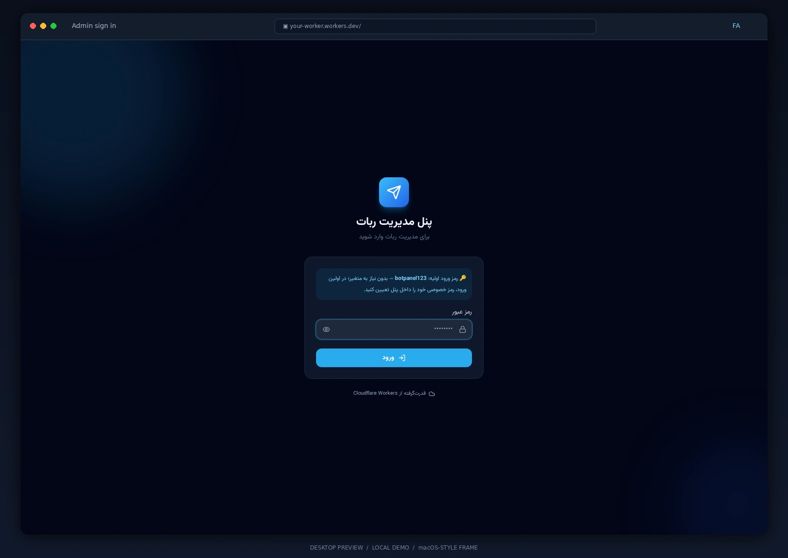
</div>

<details>
<summary><b>▸ ورود اول با رمز پیش‌فرض و ساخت رمز خصوصی</b></summary>

<div dir="rtl">

1. آدرس Worker را در مرورگر باز کنید.
2. در نصب تازه، رمز اولیه **`botpanel123`** است؛ نیازی به ساخت متغیر محیطی نیست.
3. بلافاصله بعد از ورود، فرم **تعیین رمز خصوصی** نمایش داده می‌شود. نشست رمز پیش‌فرض به هیچ بخش دیگری دسترسی ندارد تا رمز عوض شود.
4. رمز جدید را وارد و ذخیره کنید. از این پس فقط رمز جدید معتبر است و همه نشست‌های قبلی باطل می‌شوند.

> 🔒 چون رمز پیش‌فرض عمومی است، این مرحله را **بلافاصله بعد از اولین استقرار** انجام دهید. برای امنیت بیشتر می‌توانید انتشار اولیه را پشت Cloudflare Access قرار دهید.

تغییر بعدی رمز از مسیر **تنظیمات ← امنیت** انجام می‌شود.

> 🔐 **رمز عبور در هر بار ورود (نسخه ۳٫۴):** نشست پنل در حافظه‌ی موقت تب (sessionStorage) نگه‌داری می‌شود، نه در حافظه‌ی ماندگار مرورگر. یعنی هرگاه پنل را در تب/پنجره‌ی جدید باز کنید یا مرورگر را ببندید، رمز عبور دوباره لازم است. ورود ادمین از داخل تلگرام همچنان با تأیید هویت `initData` بدون رمز انجام می‌شود.

</div>

</details>

---

## ۵. اتصال ربات به پنل

<details>
<summary><b>▸ ثبت توکن، تست اتصال و ثبت وب‌هوک</b></summary>

<div dir="rtl">

1. وارد **تنظیمات ← تنظیمات ربات** شوید و توکن BotFather را ثبت کنید.
2. زبان ربات را انتخاب کنید: فقط فارسی، فقط انگلیسی یا دوزبانه (کاربر انتخاب می‌کند).
3. در **تنظیمات ← مدیریت وب‌هوک**، دکمه **ثبت وب‌هوک** را بزنید. این کار آدرس Worker، `WEBHOOK_SECRET` و انواع رویدادهای لازم (از جمله `chat_member` و `channel_post`) را برای ربات ثبت می‌کند.
4. وضعیت وب‌هوک همان‌جا نمایش داده می‌شود؛ اگر خطای «آخرین خطا» دیدید، آدرس و Secret را بررسی کنید.
5. با یک حساب آزمایشی به ربات `/start` بفرستید. اگر پاسخ گرفتید، اتصال کامل است.

> ⚠️ هر توکن تلگرام فقط **یک وب‌هوک فعال** دارد. ثبت وب‌هوک اینجا، دریافت پیام در هر سرویس قبلی با همان توکن را قطع می‌کند.

**گروه‌ها:** ربات را در گروه ادمین کنید و دسترسی حذف پیام و محدودسازی بدهید. اگر ربات باید همه پیام‌های گروه را ببیند، Privacy Mode را در BotFather غیرفعال کنید.

</div>

</details>

---

## ۶. راهنمای بخش‌های پنل

> هر زیربخش زیر، **جداگانه و از صفر تا صد** توضیح داده شده است. روی فلش ▸ بزنید.

### ۶٫۱ داشبورد

<details>
<summary><b>▸ داشبورد — نبض ربات در یک صفحه</b></summary>

<div dir="rtl">

**چه می‌بینید:**

- تعداد کل کاربران، کاربران فعال امروز و کاربران جدید.
- وضعیت ربات (اتصال توکن، وب‌هوک، یوزرنیم).
- آخرین ارسال‌های همگانی و درصد تحویل.
- تیکت‌های خوانده‌نشده پشتیبانی.
- خلاصه فروش/سرویس در صورت فعال بودن ماژول‌ها.

**نحوه استفاده:**

1. بعد از ورود، به‌صورت خودکار روی داشبورد قرار می‌گیرید.
2. کارت‌ها قابل کلیک‌اند و شما را به بخش مربوطه می‌برند.
3. اگر عددی صفر است، یعنی ماژول مربوطه هنوز فعال یا استفاده نشده است.

**نکته:** اعداد داشبورد از داده واقعی SQLite خوانده می‌شوند؛ نیازی به رفرش دستی مکرر نیست.

</div>

</details>

### ۶٫۲ کارگاه ربات (Bot Studio)

<div align="center">
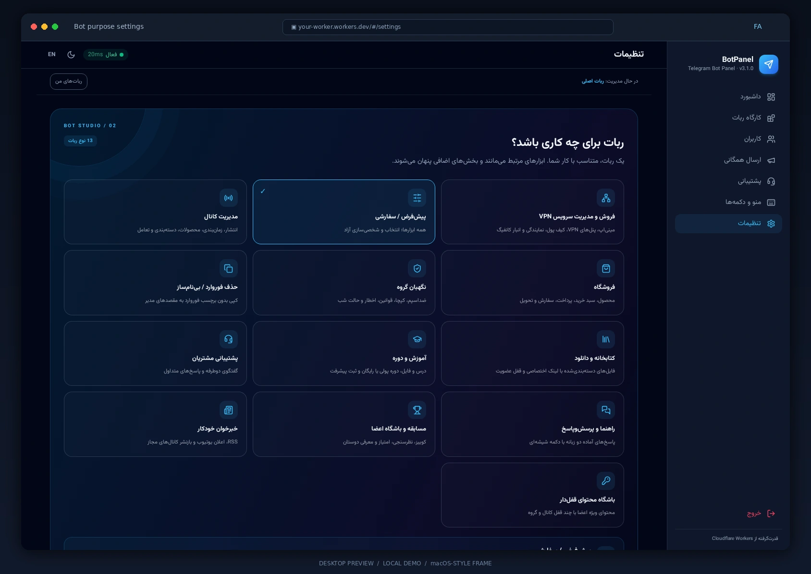
</div>

<details>
<summary><b>▸ نمای کلی و انتخاب «نوع ربات»</b></summary>

<div dir="rtl">

کارگاه، فضای اصلی ساخت ربات است. اولین کار، انتخاب **کاربری ربات** است:

| نوع | مناسب چه کسی |
|-----|---------------|
| فروشگاه | فروش محصول دیجیتال یا فیزیکی |
| سرویس / VPN | فروش و تمدید کانفیگ و اکانت |
| کانال‌دار | انتشار خودکار و مدیریت اعضا |
| مدیریت گروه | قوانین، ضدلینک، خوش‌آمد |
| پرسش و پاسخ | ربات پاسخگو |
| آموزشی | ارائه دوره و پیگیری پیشرفت |
| خبر کل کشور | انتشار دسته‌بندی‌شده‌ی اخبار ایران و خبرهای جهانی (با ترجمه فارسی) |
| قیمت دلار و طلا و تتر | نرخ لحظه‌ی بازار با انتشار زمان‌بندی‌شده به کانال/گروه |
| سفارشی | خودتان ماژول‌ها را تیک می‌زنید |

**نحوه استفاده:**

1. وارد **کارگاه ربات ← نمای کلی** شوید.
2. روی کارت نوع دلخواه کلیک کنید (کارت انتخاب‌شده حاشیه رنگی می‌گیرد).
3. دکمه **ذخیره** را بزنید. با تغییر نوع، فقط تب‌های مرتبط در نوار بالا نمایش داده می‌شوند.
4. در حالت **سفارشی**، فهرست ماژول‌ها ظاهر می‌شود و هر کدام را می‌خواهید تیک بزنید.

**نکته مهم:** با تغییر نوع ربات، داده‌های قبلی حذف نمی‌شوند؛ فقط تب‌های نمایش‌داده‌شده تغییر می‌کند.

</div>

</details>

<details>
<summary><b>▸ فروشگاه و کاتالوگ محصولات (سبد خرید، جستجو و پرداخت)</b></summary>

<div dir="rtl">

**امکانات کامل فروشگاهی:**

1. **مدیریت کاتالوگ و دسته‌بندی‌ها:**
   - افزودن محصولات فیزیکی یا دانلودی/دیجیتال با تصویر، قیمت، توضیحات دوزبانه و تعیین دسته‌بندی.
   - تعیین موجودی انبار با کسر خودکار هنگام خرید و جلوگیری از فروش بیش از موجودی (Atomic Stock Locking).
   - **جستجوی آنی محصولات:** کاربران می‌توانند با دستور `/search <نام محصول>` یا دکمه جستجو، محصولات دلخواه را در کاتالوگ پیدا کنند.

2. **سبد خرید هوشمند:**
   - افزودن چند کالا، تغییر تعداد، حذف آیتم‌ها و مشاهده جمع کل مبلغ سفارش.
   - اعمال کدهای تخفیف درصدی یا مبلغی.
   - استفاده از امتیازهای وفاداری باشگاه مشتریان برای تخفیف در فاکتور نهایی.

3. **تسویه‌حساب و پرداخت چندگانه:**
   - **پرداخت آنلاین:** درگاه زرین‌پال، درگاه رمزارزی/تتر و استارز تلگرام.
   - **کارت‌به‌کارت و بارگذاری فیش:** نمایش شماره کارت مدیر، آپلود عکس فیش توسط کاربر و ارسال به صف بررسی پنل مدیریت.
   - **دریافت اطلاعات خریدار فیزیکی:** فرم مرحله‌به‌مرحله جمع‌آوری نام، شماره تماس، نشانی پستی دقیق و بازه زمانی تحویل.

4. **مدیریت سفارش‌ها در پنل:**
   - مشاهده سفارش‌ها در وضعیت‌های: در انتظار پرداخت، در حال بررسی فیش، پرداخت‌شده، در حال آماده‌سازی، ارسال‌شده، تحویل‌شده و لغو/رد شده.
   - ارسال خودکار پیام تغییر وضعیت و کد رهگیری پستی به تلگرام مشتری.
   - **دکمه‌های بازگشت همگانی (🔙 بازگشت):** تمامی مراحل، فاکتورها، سبد خرید و صفحات محصولات دارای دکمه‌های بازگشت به منوی اصلی و فهرست قبلی هستند.

</div>

</details>

<details>
<summary><b>▸ ربات نرخ لحظه‌ای طلا، دلار، سکه، تتر و رمزارزها (Rates & Currency Bot)</b></summary>

<div dir="rtl">

**امکانات ربات نرخ و قیمت لحظه‌ای:**

1. **نمایش زنده بازار طلا و سکه:**
   - قیمت طلای ۱۸ عیار، طلای ۲۴ عیار، مثقال طلا و انس جهانی طلا (USD).
   - قیمت سکه تمام امامی، سکه بهار آزادی (طرح قدیم)، نیم‌سکه، ربع‌سکه و سکه گرمی.
2. **ارزهای بازار آزاد:**
   - دلار آمریکا، یورو اروپا، درهم امارات، پوند انگلیس، لیر ترکیه، ۱۰۰ دینار عراق، یوان چین و دلار کانادا.
3. **رمزارزها و استیبل‌کوین‌ها:**
   - قیمت تتر (USDT)، بیت‌کوین (BTC)، اتریوم (ETH)، تون‌کوین (TON)، ترون (TRX) به ریال/تومان و دلار.
4. **تحلیل نوسانات و سود/زیان:**
   - نمایش درصد تغییرات ۲۴ ساعته با آیکون‌های صعودی 🟢 و نزولی 🔴، بیشترین (High) و کمترین (Low) قیمت روزانه، و ساعت دقیق بروزرسانی.
- **منبع نرخ‌ها:** چند لایه منبع زنده بازار ایران (طلا/سکه، ارز آزاد، تتر و رمزارز) با کش یک‌دقیقه‌ای؛ اگر منابع اصلی JSON در دسترس نباشند، نرخ‌های دلاری رمزارز و انس طلا از منابع جهانی و دلار آزاد از فید تومانی و صفحه‌های مرجع بازار ایران (moj3.ir، alanchand.com، isignal.ir) خوانده می‌شود و ردیف‌های باقی‌مانده از همین داده‌های زنده محاسبه و با برچسب «محاسبه‌شده» مشخص می‌شوند. هر عدد پس از تبدیل واحد (تومان/ریال) با بازهٔ معقول همان دارایی سنجیده می‌شود. دکمه «بررسی منابع نرخ» در پنل (و `GET /api/rates/sources`) وضعیت هر منبع را با علت خطا نشان می‌دهد. فقط اگر همهٔ منابع لحظه‌ای قطع باشند، آخرین نرخ معتبر ذخیره‌شده با هشدار «قدیمی بودن» ارسال می‌شود تا جدول هیچ‌وقت خالی نماند.
5. **ورود یک‌دکمه‌ای و زمان‌بندی انتشار:**
   - کاربر با یک دکمه «📈 قیمت دلار و طلا و تتر» وارد بخش قیمت می‌شود و دسته (طلا و سکه / ارزهای بازار آزاد / رمزارزها) را انتخاب می‌کند؛ دستورات `/rates`, `/price`, `/gold`, `/dollar`, `/arz` همان مسیر را باز می‌کنند.
   - **زمان‌بندی:** ساعت روزانه (به وقت تهران) برای انتشار خودکار جدول در کانال/گروه + انتخاب نوع ارز (طلا / ارز / کریپتو / همه) + فهرست مقصدها — از **تنظیمات ← بخش قیمت** در پنل یا `/admin` ← 📈 مدیریت قیمت در تلگرام.
   - دکمه «📡 ارسال فوری» هم جدول لحظه‌ای را همین حالا به مقصدها می‌فرستد.
   - **جدول زنده داخل پنل:** در **تنظیمات ← بخش قیمت**، جدول کامل بازار (طلا و سکه، ارزها، رمزارزها) با برچسب «نرخ زنده / آخرین نرخ ذخیره‌شده»، نام منبع و ساعت بروزرسانی نمایش داده می‌شود و با دکمه «بروزرسانی جدول» تازه می‌شود.

</div>

</details>

<details>
<summary><b>▸ ربات خبر کل کشور (Nation-wide news publisher)</b></summary>

<div dir="rtl">

**امکانات ربات خبرخوان نسخه ۳٫۴:**

1. **مسیر یک‌دست از شروع:** با `/start` فقط یک دکمه «📰 خبر» می‌بینید؛ با لمس آن، صفحه‌ی بعد دو گزینه دارد: «🇮🇷 اخبار ایران» و «🌍 خبر جهانی».
2. **دسته‌بندی جداگانه برای هر منطقه:**
   - **اخبار ایران:** خبر فوری، سیاسی، اقتصادی، ورزشی و فناوری (فید خبرگزاری‌های رسمی: ایرنا، ایسنا، مهر، تسنیم، تابناک).
   - **خبر جهانی:** همه / سیاسی / اقتصادی / ورزشی / فناوری — از منابع بین‌المللی و **تمامی عنوان‌ها به‌صورت خودکار ترجمه فارسی می‌شوند** (با کش ۳۰ روزه برای جلوگیری از تکرار درخواست).
3. **تعاملی و دوطرفه:**
   - نمایش هر دسته با دکمه‌های شیشه‌ای ورق‌زدن خبرها همراه با «🔙 بازگشت به دسته‌بندی» و «🔙 منوی اصلی».
   - دستورات `/news` و `/khabar` همان مسیر را باز می‌کنند؛ دکمه «🔄 تازه‌سازی» آخرین وضعیت را می‌گیرد.
4. **انتشار زمان‌بندی‌شده به کانال/گروه:**
   - یا **ساعت روزانه** (مثلاً ۰۹:۰۰ به وقت تهران) برای یک خبرنامه هر روزه، یا **فاصله تکراری** (۱۰ تا ۱۴۴۰ دقیقه).
   - دسته (یا ترکیب همه دسته‌ها) و مقصدها را در **تنظیمات ← بخش خبر** یا از تلگرام با `/admin` ← 📰 مدیریت اخبار تعیین کنید.
   - خبرهای تکراری دوباره ارسال نمی‌شوند و اگر خبر تازه‌ای نباشد، ارسال انجام نمی‌شود.

</div>

</details>

<details>
<summary><b>▸ سفارش‌ها و رسیدها</b></summary>

<div dir="rtl">

**کاربرد:** پیگیری خریدها و تأیید پرداخت‌های کارت‌به‌کارت.

**گام‌به‌گام:**

1. **کارگاه ربات ← سفارش‌ها** فهرست همه سفارش‌ها را با وضعیت نشان می‌دهد: در انتظار، بررسی رسید، پرداخت‌شده، رد شده.
2. برای سفارش‌های کارت‌به‌کارت، عکس رسید کاربر همان‌جا قابل مشاهده است.
3. با **تأیید**، محصول بلافاصله برای کاربر ارسال و سفارش «پرداخت‌شده» می‌شود.
4. با **رد**، دلیل را می‌نویسید و برای کاربر پیام می‌رود.

**نکته:** اگر کاربر بعد از خرید از کانال اجباری خارج شود، تحویل تا بازگشت او متوقف می‌ماند.

</div>

</details>

<details>
<summary><b>▸ تخفیف‌ها</b></summary>

<div dir="rtl">

1. **کارگاه ربات ← تخفیف‌ها ← کد جدید**.
2. کد (مثلاً `WELCOME20`)، نوع (درصدی یا مبلغی)، سقف استفاده و تاریخ انقضا را تعیین کنید.
3. می‌توانید کد را به محصول یا پلن خاصی محدود کنید.
4. کاربر هنگام خرید، کد را وارد و قیمت به‌روز می‌شود.

</div>

</details>

<details>
<summary><b>▸ انتشار خودکار در کانال</b></summary>

<div dir="rtl">

1. ربات را در کانال ادمین کنید.
2. **کارگاه ربات ← انتشار خودکار** را باز کنید و شناسه کانال را وارد کنید.
3. پست را بنویسید، رسانه و دکمه‌ها را اضافه کنید و **زمان انتشار** را تعیین کنید.
4. Cron هر دقیقه صف را بررسی و در زمان مقرر پست می‌کند.
5. تاریخچه انتشار با وضعیت موفق/ناموفق در همان تب دیده می‌شود.

</div>

</details>

<details>
<summary><b>▸ مدیریت گروه (نگهبان پیشرفته گروه با ۱۳ قابلیت جامع)</b></summary>

<div dir="rtl">

بخش **مدیریت گروه** یکی از جامع‌ترین امکانات پنل است که کنترل، امنیت، پاکسازی و سرگرمی گروه‌های تلگرامی شما را به‌صورت خودکار بر عهده می‌گیرد:

1. **قفل گروه و رسانه‌ها (Group & Media Locks):**
   - قفل کامل چت گروه با یک کلیک یا دستور `/lock` و بازگشایی با `/unlock`.
   - قفل اختصاصی ۱۱ نوع رسانه: عکس، ویدیو/فیلم، ویس/صدا، موسیقی/آهنگ، فایل و سند، استیکر، گیف و انیمیشن، مخاطب، لوکیشن/مکان، نظرسنجی و ویدیومسیج.
   - قفل ارسال لینک، فوروارد پیام، و قفل منشن/یوزرنیم (`@`).

2. **خوش‌آمدگویی هوشمند و پاکسازی (Smart Welcome & Cleanup):**
   - متن خوش‌آمدگویی سفارشی فارسی و انگلیسی با متغیرهای داینامیک نام کاربر `{name}`، آیدی عددی `{id}`، و ساعت/تاریخ ورود `{time}`.
   - قابلیت ارسال عکس خوش‌آمدگویی همراه با متن.
   - پاکسازی خودکار پیام‌های پیش‌فرض ورود و خروج اعضای گروه تلگرام (Service Messages).
   - پاکسازی زمان‌بندی‌شده پیام خوش‌آمد ربات بعد از چند ثانیه مشخص تا چت گروه شلوغ نشود.

3. **فیلتر کلمات و عبارات ممنوعه (Word Filter):**
   - تعریف لیست سیاه کلمات و عبارات نامناسب یا تبلیغاتی (هر خط یک عبارت).
   - حذف آنی پیام‌های حاوی عبارات ممنوعه و اعمال جریمه تنبیهی به فرستنده.

4. **اخطار و جریمه کاربران (Warnings & Sanctions):**
   - شمارنده هوشمند اخطار با تعیین حد نصاب (مثلاً ۳ اخطار).
   - جریمه خودکار در صورت رسیدن به حد نصاب: سکوت موقت (Mute) یا اخراج و مسدودسازی (Ban).
   - دستورات مدیریتی اخطار: `/warn` (ثبت اخطار با ریپلای)، `/unwarn` (کاهش یک اخطار)، `/warns` (مشاهده اخطارهای کاربر)، و `/resetwarn` (صفر کردن اخطارها).

5. **پاسخ‌های آماده و سریع (Canned Responses):**
   - تعریف کلمات کلیدی پرتکرار و پاسخ‌های خودکار اختصاصی (راهنما، لینک سایت، تعرفه‌ها، پشتیبانی).
   - پاسخ‌دهی خودکار ربات با ریپلای روی پیام حاوی کلمه کلیدی.

6. **اتوماسیون و حالت شب / خاموشی (Night Mode & Shutdown):**
   - قفل خودکار گروه در ساعات شبانه (مثلاً از ۲۳:۰۰ تا ۰۷:۰۰ صبح) و بازگشایی خودکار در ساعت مقرر.
   - پشتیبانی از منطقه زمانی رسمی (`Asia/Tehran`).

7. **کنترل متن و محتوا (Text Constraints):**
   - تعیین حداقل تعداد کلمات پیام (جلوگیری از پیام‌های کوتاه و اسپم).
   - تعیین حداکثر تعداد کلمات پیام (جلوگیری از پیام‌های طوماری و تبلیغاتی).
   - تنظیم کلمه یا هشتگ اجباری در متن پیام (مناسب برای چالش‌ها، مسابقات و تبادلات).
   - محدودیت تعداد مجاز ایموجی و هشتگ در هر پیام.

8. **دستورات مدیریتی با ریپلای (Admin Commands):**
   - `/ban` — مسدودسازی و اخراج کاربر متخلف از گروه.
   - `/unban` — رفع مسدودیت کاربر.
   - `/mute 2h` یا `/mute 30m` — سکوت موقت کاربر برای مدت مشخص.
   - `/unmute` — لغو حالت سکوت کاربر.
   - `/warn` و `/resetwarn` — مدیریت اخطارها.
   - `/lock` و `/unlock` — قفل سریع یا بازگشایی چت گروه.
   - `/clean 20` — حذف دسته‌جمعی ۲۰ پیام اخیر گروه.
   - `/raffle` — اجرای مسابقه و قرعه‌کشی گروهی.

9. **عضوگیر / اد اجباری (Forced Add Requirement):**
   - الزام کاربران به افزودن (Add) تعداد مشخصی عضو به گروه قبل از مجاز شدن به ارسال پیام.
   - شمارش دقیق کاربران اضافه‌شده توسط هر عضو.

10. **دستورات کاربران عادی گروه:**
    - `/rules` — نمایش قوانین و مقررات گروه به کاربر.
    - `/link` — دریافت لینک رسمی دعوت گروه.
    - `/report` — گزارش پیام متخلف با ریپلای برای ادمین‌های گروه.

11. **ضد اسپم و کنترل نرخ پیام (Anti-Spam / Flood Protection):**
    - محدودیت تعداد پیام ارسالی در بازه چند ثانیه‌ای برای جلوگیری از ربات‌های مخرب و فوروارد رگباری.

12. **کپچای ورود اعضا (Anti-Bot Captcha):**
    - تأیید ورود کاربران جدید با حل جمع ریاضی ساده یا فشردن دکمه تأیید.
    - اخراج خودکار کاربرانی که در مهلت مقرر کپچا را تکمیل نکنند.

13. **قرعه‌کشی و جایزه گروهی (Group Giveaway / Raffle):**
    - ساخت باکس شیشه‌ای قرعه‌کشی در گروه با دستور `/raffle`.
    - ثبت‌نام اعضا با دکمه شیشه‌ای «شرکت در قرعه‌کشی».
    - انتخاب خودکار و کاملاً تصادفی (Cryptographically Secure) برنده با دکمه پایان توسط ادمین و تگ برنده در گروه.

</div>

</details>

<details>
<summary><b>▸ حذف فوروارد (Relay) — ربات بعد از گرفتن فایل از ادمین می‌پرسد</b></summary>

<div dir="rtl">

این ابزار پیام یا فایل کاربر را **بدون برچسب فوروارد** در کانال یا گروه بازنشر می‌کند (با `copyMessage` / `copyMessages`، نه `forwardMessage`).

1. در **تنظیمات ← حذف فوروارد / بی‌نام‌ساز**، دریافت پیام را فعال کنید، مقصدها (عنوان | آیدی کانال/گروه) را ثبت و «تأیید مدیر» را روشن کنید.
2. کاربر فایل یا پیام را برای ربات می‌فرستد؛ ربات بلافاصله در چت ادمین **می‌پرسد**: «این پیام به کانال/گروه ارسال شود؟»
3. با دکمه **«✅ انتشار در مقصدها»** پیام بدون فوروارد به همه مقصدها می‌رود؛ با **«❌ رد»** بایگانی می‌شود. از پنل وب (کارگاه ← حذف فوروارد) هم می‌توان مقصد هر پیام را جداگانه انتخاب کرد.
4. هویت فرستنده فقط برای ادمین دیده می‌شود و به مقصد نمی‌رود.
5. همین عملیات از تلگرام با `/admin` ← 🪄 حذف فوروارد هم انجام می‌شود.

</div>

</details>

<details>
<summary><b>▸ بخش خبر — دسته‌بندی، زمان‌بندی روزانه و ارسال به کانال/گروه</b></summary>

<div dir="rtl">

اخبار از معتبرترین خبرگزاری‌ها (ایرنا، ایسنا، مهر، تسنیم، تابناک) و منابع بین‌المللی جمع‌آوری و **با کلیدواژه دسته‌بندی می‌شوند**؛ اخبار ایران و خبرهای جهانی جداگانه و با ترجمه فارسی نمایش داده می‌شوند.

1. کاربران داخل ربات با یک دکمه «📰 خبر» وارد می‌شوند و در صفحه‌ی بعد «🇮🇷 اخبار ایران» یا «🌍 خبر جهانی» را انتخاب می‌کنند؛ سپس دسته دلخواه (فوری، سیاسی، اقتصادی، ورزشی، فناوری / همه) را می‌بینند. دستورات `/news` و `/khabar` همان مسیر را باز می‌کنند.
2. در **تنظیمات ← بخش خبر** (یا `/admin` ← 📰 مدیریت اخبار در تلگرام):
   - **ارسال فوری:** دسته را انتخاب کنید (مثلاً ورزشی، سیاسی یا «همه دسته‌ها») و به کانال/گروه‌های ثبت‌شده بفرستید.
   - **زمان‌بندی:** ارسال خودکار را فعال و یکی از دو حالت را تعیین کنید:
     - **ساعت روزانه** (مثلاً `09:00` به وقت تهران) → هر روز یک خبرنامه در همان ساعت،
     - **فاصله تکراری** (۱۰ تا ۱۴۴۰ دقیقه) → به‌صورت دوره‌ای تا وقتی خاموش شود.
   - اجرا در سرور (cron) انجام می‌شود و پنل لازم نیست باز بماند. خبرهای تکراری دوباره ارسال نمی‌شوند و اگر خبر تازه‌ای نباشد، ارسال انجام نمی‌شود.
   - **مقصدها:** هر خط به شکل «عنوان | آیدی» (مثل `کانال خبر | @newschannel` یا `گروه ورزشی | -1001234567890`).
3. ربات باید در کانال/گروه مقصد اجازه ارسال داشته باشد (ادمین باشد).

</div>

</details>

<details>
<summary><b>▸ بخش قیمت — زمان‌بندی انتشار جدول دلار، طلا و تتر</b></summary>

<div dir="rtl">

در **تنظیمات ← بخش قیمت** (یا `/admin` ← 📈 مدیریت قیمت در تلگرام):

1. **ارسال فوری:** نوع ارز (طلا و سکه / ارزهای بازار آزاد / رمزارزها و تتر / همه) را انتخاب و دکمه «📡 ارسال فوری قیمت» را بزنید؛ جدول لحظه‌ای با درصد نوسان به مقصدها می‌رود. دکمه «پیش‌نمایش جدول قیمت» متن دقیق را قبل از ارسال نشان می‌دهد.
2. **زمان‌بندی روزانه:**
   - **نوع ارز:** انتخابی که هر روز منتشر شود (طلا، ارز، کریپتو یا همه).
   - **ساعت روزانه** (به وقت تهران، مثلاً `09:00`)؛ با فعال بودن «ارسال خودکار روزانه»، جدول هر روز در همان ساعت به همه مقصدها ارسال می‌شود.
   - **مقصدها:** هر خط به شکل «عنوان | آیدی» (مثل `کانال قیمت | @rateschannel`).
3. اجرا در سرور انجام می‌شود و پنل لازم نیست باز بماند. ربات باید در مقصدها ادمین باشد.
4. **جدول زنده بازار:** انتهای همین بخش، جدول کامل و زنده بازار ایران (طلا/سکه، ارز، رمزارز) با درصد نوسان، منبع و ساعت بروزرسانی نمایش داده می‌شود؛ اگر بازار قطع باشد، آخرین نرخ ذخیره‌شده با برچسب هشدار دیده می‌شود.

</div>

</details>


<details>
<summary><b>▸ باشگاه مشتریان (امتیاز و جوایز)</b></summary>

<div dir="rtl">

1. تب **باشگاه مشتریان** را باز کنید و امتیاز هر رویداد (عضویت، خرید، دعوت دوست، فعالیت روزانه) را تعیین کنید.
2. سطح‌ها را تعریف کنید (برنز، نقره، طلا …) و پاداش هر سطح را مشخص کنید.
3. کاربر امتیاز و سطح خود را در ربات و مینی‌اپ می‌بیند.
4. جوایز مثل گردونه شانس و قرعه‌کشی در بخش **سرویس ← گردونه و قرعه‌کشی** تنظیم می‌شوند.

</div>

</details>

<details>
<summary><b>▸ پرسش و پاسخ (FAQ)</b></summary>

<div dir="rtl">

1. تب **پرسش و پاسخ** ← **افزودن پرسش**.
2. پرسش و پاسخ را (در صورت دوزبانه بودن ربات، برای هر دو زبان) بنویسید.
3. ترتیب نمایش را با کشیدن یا شماره‌گذاری تعیین کنید.
4. کاربر در ربات فهرست پرسش‌ها را می‌بیند و با انتخاب هر پرسش، **همان پیام** با متن پاسخ به‌روز می‌شود (پیام جدید ارسال نمی‌شود).

</div>

</details>

<details>
<summary><b>▸ رسانه‌ها و آپلود مستقیم</b></summary>

<div dir="rtl">

<div align="center">
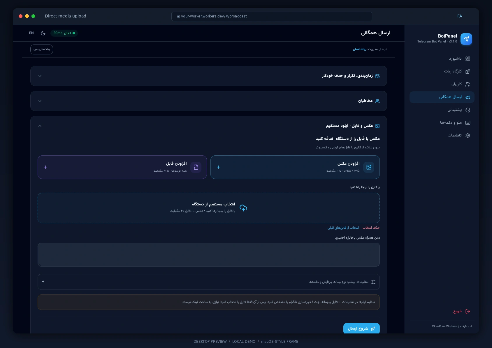
</div>

1. ابتدا در **تنظیمات ← فایل و رسانه** یکی از این دو را تعیین کنید:
   - آیدی عددی مدیری که قبلاً ربات را استارت کرده، یا
   - یک کانال/گروه اختصاصی که ربات در آن اجازه ارسال (و ترجیحاً حذف) دارد.
2. در تب **رسانه‌ها** فایل را انتخاب کنید. فایل به آن چت فرستاده می‌شود، `file_id` ذخیره و پیام موقت حذف می‌شود.
3. از این پس می‌توانید همان رسانه را در محصول، پست کانال یا ارسال همگانی انتخاب کنید.

**محدودیت:** عکس تا ۱۰ مگابایت، سایر فایل‌ها تا ۲۰ مگابایت. با تغییر توکن ربات باید فایل‌ها دوباره آپلود شوند.

</div>

</details>

### ۶٫۳ کاربران

<details>
<summary><b>▸ مدیریت کاربران</b></summary>

<div dir="rtl">

**چه می‌بینید:** فهرست همه کسانی که ربات را استارت کرده‌اند، با نام، آیدی، زبان، تاریخ عضویت و وضعیت.

**کارهایی که می‌توانید انجام دهید:**

| کار | نحوه انجام |
|-----|-------------|
| جست‌وجو | نام یا آیدی عددی را در کادر بالا بنویسید |
| مسدودسازی | دکمه «مسدود» روی ردیف کاربر؛ ربات دیگر به او پاسخ نمی‌دهد |
| رفع مسدودی | همان دکمه در حالت مسدود |
| مشاهده جزئیات | کلیک روی ردیف: سفارش‌ها، کیف پول، تیکت‌ها، امتیاز |
| پیام مستقیم | از همان صفحه می‌توانید برای کاربر پیام بفرستید |
| صفحه‌بندی | دکمه‌های بعدی/قبلی پایین جدول |

**نکته:** حذف کاربر وجود ندارد چون تاریخچه سفارش‌ها به آن وابسته است؛ به‌جای آن از مسدودسازی استفاده کنید.

</div>

</details>

### ۶٫۴ ارسال همگانی

<details>
<summary><b>▸ ارسال پیام به همه کاربران — گام‌به‌گام</b></summary>

<div dir="rtl">

این صفحه خودش چند بخش آکاردئونی دارد:

| بخش | کاربرد |
|------|--------|
| **مخاطب** | همه کاربران، فهرست آیدی دلخواه، یا یک کانال/گروه |
| **متن** | پیام متنی با دکمه‌های شیشه‌ای |
| **نظرسنجی** | ساخت نظرسنجی با گزینه‌های دلخواه |
| **عکس** | ارسال عکس با کپشن |
| **نتایج** | تعداد ارسال‌شده، ناموفق و مسدود |
| **تاریخچه** | ارسال‌های گذشته و وضعیت آن‌ها |

**گام‌به‌گام:**

1. بخش **مخاطب** را باز و مقصد را انتخاب کنید.
2. یکی از بخش‌های متن/نظرسنجی/عکس را باز و محتوا را بسازید.
3. دکمه‌ها را (در صورت نیاز) با متن و لینک اضافه کنید.
4. **ارسال** را بزنید. ارسال به‌صورت صف پس‌زمینه انجام می‌شود؛ می‌توانید صفحه را ببندید.
5. پیشرفت را در **نتایج** ببینید؛ کاربرانی که ربات را بلاک کرده‌اند خودکار علامت می‌خورند.

**تنظیم سرعت:** اندازه دسته و فاصله زمانی در **تنظیمات ← تنظیم ارسال** قابل تغییر است. مقدار پیش‌فرض برای محدودیت‌های تلگرام ایمن است.

</div>

</details>

### ۶٫۵ پشتیبانی

<details>
<summary><b>▸ تیکت‌ها، پاسخ مدیر و گفتگوی مینی‌اپ</b></summary>

<div dir="rtl">

**چه می‌بینید:** فهرست گفتگوهای پشتیبانی. هر کاربر یک گفتگوی پیوسته دارد؛ تعداد پیام‌های خوانده‌نشده کنار نام او نمایش داده می‌شود.

**گردش کار:**

1. کاربر از **دکمه پشتیبانی ربات** یا از **تب پشتیبانی مینی‌اپ** پیام می‌فرستد.
2. پیام بلافاصله در **پنل ← پشتیبانی** ثبت می‌شود و شمارنده خوانده‌نشده بالا می‌رود.
3. روی گفتگو کلیک کنید تا کل تاریخچه را ببینید؛ با باز کردن، پیام‌ها خوانده‌شده می‌شوند.
4. پاسخ را بنویسید و **ارسال** را بزنید. پاسخ **هم‌زمان**:
   - به‌صورت پیام تلگرام برای کاربر ارسال می‌شود، و
   - در تب پشتیبانی مینی‌اپ او نمایش داده می‌شود.
5. با **بستن گفتگو**، تیکت آرشیو می‌شود؛ پیام بعدی کاربر دوباره آن را باز می‌کند.

**تنظیمات مرتبط:**

- برای اینکه دکمه پشتیبانی همیشه زیر پیام‌ها باشد: **تنظیمات ← تنظیمات ربات ← نمایش همیشگی دکمه پشتیبانی**.
- برای دریافت اعلان پیام‌های جدید در یک گروه مدیریتی: در **سرویس ← تنظیمات**، «چت گزارش» را تعیین کنید.

</div>

</details>

### ۶٫۶ منو و دکمه‌ها

<div align="center">
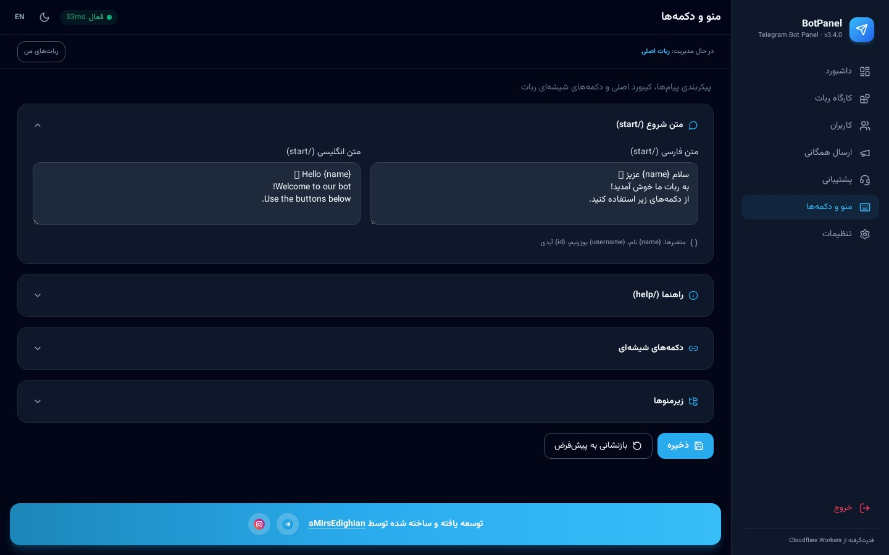
</div>

<details>
<summary><b>▸ ساخت منوی ربات، زیرمنو و متن استارت</b></summary>

<div dir="rtl">

این صفحه هم آکاردئونی است:

| بخش | کاربرد |
|------|--------|
| **متن استارت** | اولین پیامی که کاربر با `/start` می‌بیند |
| **متن راهنما** | پاسخ دکمه/دستور راهنما |
| **دکمه‌های صفحه** | دکمه‌های شیشه‌ای زیر پیام |
| **زیرمنوها** | صفحه‌های تودرتو |

**گام‌به‌گام:**

1. **متن استارت** را باز کنید و پیام خوش‌آمد را بنویسید (در حالت دوزبانه، هر دو زبان).
2. در **دکمه‌های صفحه**، با **افزودن دکمه** ردیف بسازید. هر دکمه می‌تواند:
   - **لینک** باشد (باز کردن سایت یا کانال)،
   - **زیرمنو** باز کند،
   - یک **متن ثابت** نشان دهد،
   - یا یک **کار داخلی** (فروشگاه، سرویس، پشتیبانی، امتیاز…) را اجرا کند.
3. برای چیدمان، دکمه‌ها را در ردیف‌های مختلف قرار دهید؛ هر ردیف می‌تواند ۱ تا ۳ دکمه داشته باشد.
4. **زیرمنوها** را بسازید و از دکمه‌ها به آن‌ها ارجاع دهید؛ داخل زیرمنو هم دکمه بازگشت خودکار قرار می‌گیرد.
5. **ذخیره** کنید و در ربات `/start` بزنید تا نتیجه را ببینید.

**رفتار جدید نسخه ۳٫۱:** با زدن هر دکمه، **همان پیام قبلی ویرایش می‌شود** و متن و دکمه‌های جدید جای آن می‌نشیند؛ دیگر چت کاربر پر از پیام‌های تکراری نمی‌شود. پیام‌های حاوی محتوای تحویلی (فایل، کانفیگ، رسید) همچنان به‌صورت پیام جدید ارسال می‌شوند تا در تاریخچه بمانند.

**رفتار ربات‌های پیش‌فرض/سفارشی (نسخه ۳٫۴):** رباتی که کاربری‌اش «پیش‌فرض / سفارشی» است، تا وقتی ادمین دکمه‌ای در همین صفحه اضافه نکرده، **بدون هیچ دکمه‌ای** شروع می‌شود — فقط متن خوش‌آمد (و برای ادمین، ردیف «🛠 پنل مدیریت»). دکمه‌های پیش‌فرض سیستمی دیگر خودکار ظاهر نمی‌شوند؛ با افزودن اولین دکمه از پنل، فقط دکمه‌های خودتان نمایش داده می‌شوند. حذف همه‌ی دکمه‌ها هم با ذخیره‌ی لیست خالی امکان‌پذیر است و ربات دوباره بدون دکمه می‌ماند.
</div>

</details>

### ۶٫۷ تنظیمات

<div align="center">

</div>

<details>
<summary><b>▸ تنظیمات ربات (توکن، زبان، دکمه پشتیبانی)</b></summary>

<div dir="rtl">

- **توکن ربات:** توکن BotFather را وارد و ذخیره کنید. مقدار ذخیره‌شده در پنل بر متغیر محیطی اولویت دارد.
- **زبان ربات:** دوزبانه، فقط فارسی یا فقط انگلیسی. در حالت دوزبانه، کاربر در اولین اجرا زبان را انتخاب می‌کند.
- **زبان پیش‌فرض:** زبان کاربران جدید تا وقتی خودشان تغییر دهند.
- **دکمه پشتیبانی همیشگی:** با فعال کردن آن، دکمه پشتیبانی زیر همه پیام‌های ربات قرار می‌گیرد؛ متن دکمه را برای هر زبان جدا وارد کنید.

همه بخش‌های این صفحه **آکاردئونی**اند و دکمه **باز/بستن همه** در بالای صفحه قرار دارد. وضعیت باز و بسته بودن هر بخش برای دفعه بعد ذخیره می‌شود.

</div>

</details>

<details>
<summary><b>▸ امنیت (تغییر رمز و نشست‌ها)</b></summary>

<div dir="rtl">

1. رمز فعلی را وارد کنید.
2. رمز جدید را دوبار بنویسید (حداقل طول در فرم اعلام می‌شود).
3. **تغییر رمز** را بزنید؛ همه نشست‌های دیگر بلافاصله باطل می‌شوند.

اگر رمز را فراموش کردید، متغیر `ADMIN_PASSWORD` را در Cloudflare تنظیم کنید و رکورد رمز را از طریق آن بازنشانی کنید.

**رفتار نشست‌ها (نسخه ۳٫۴):** نشست پنل تا **بستن تب** اعتبار دارد؛ باز کردن پنل در تب/پنجره‌ی جدید یا اجرای دوباره‌ی مرورگر، رمز عبور را دوباره لازم می‌کند. نشست‌های فعال از همین صفحه قابل باطل‌سازی هم هستند.
</div>

</details>

<details>
<summary><b>▸ قفل عضویت کانال</b></summary>

<div dir="rtl">

1. گزینه **فعال‌سازی قفل** را تیک بزنید.
2. شناسه کانال (`@channel`) و لینک عضویت را وارد کنید.
3. ربات را در آن کانال ادمین کنید تا بتواند عضویت را بررسی کند.
4. کاربری که عضو نباشد، پیام عضویت و دکمه «بررسی عضویت» می‌بیند؛ بعد از عضویت، کار نیمه‌تمام او (مثلاً دیپ‌لینک محصول) خودکار ادامه می‌یابد.

می‌توانید قفل را به یک بخش خاص (فروشگاه، سرویس، گروه) محدود کنید تا در باقی بخش‌ها اعمال نشود.

</div>

</details>

<details>
<summary><b>▸ مدیریت وب‌هوک</b></summary>

<div dir="rtl">

- **ثبت وب‌هوک:** آدرس فعلی Worker را با Secret و رویدادهای لازم ثبت می‌کند.
- **حذف وب‌هوک:** ارتباط تلگرام با این Worker را قطع می‌کند (برای انتقال ربات به سرور دیگر).
- کادر وضعیت، آخرین خطا و تعداد آپدیت‌های در انتظار را نشان می‌دهد؛ برای عیب‌یابی اینجا را ببینید.
- ⚠️ **مهم:** تا «ثبت وب‌هوک» را نزنید، تلگرام هیچ پیامی به ربات نمی‌رساند و ربات کاملاً از کار می‌افتد. بعد از ثبت توکن و آیدی عددی مدیر، پنل خودش با بنر و پنجره این موضوع را یادآوری می‌کند.

</div>

</details>

<details>
<summary><b>▸ تنظیم سرعت ارسال</b></summary>

<div dir="rtl">

- **اندازه دسته:** تعداد پیام در هر دور (۱ تا ۵۰).
- **فاصله (میلی‌ثانیه):** مکث بین دسته‌ها (۲۰ تا ۵۰۰).

اگر خطای محدودیت نرخ (429) گرفتید، اندازه دسته را کم و فاصله را زیاد کنید.

</div>

</details>

<details>
<summary><b>▸ ترجیحات پنل (تم و زبان)</b></summary>

<div dir="rtl">

- شش تم آماده: تیره، روشن، اقیانوس، بنفش، جنگل، غروب.
- زبان پنل: فارسی یا انگلیسی (مستقل از زبان ربات).
- انتخاب شما در مرورگر ذخیره می‌شود.

</div>

</details>

### ۶٫۸ سرویس و VPN

<div align="center">
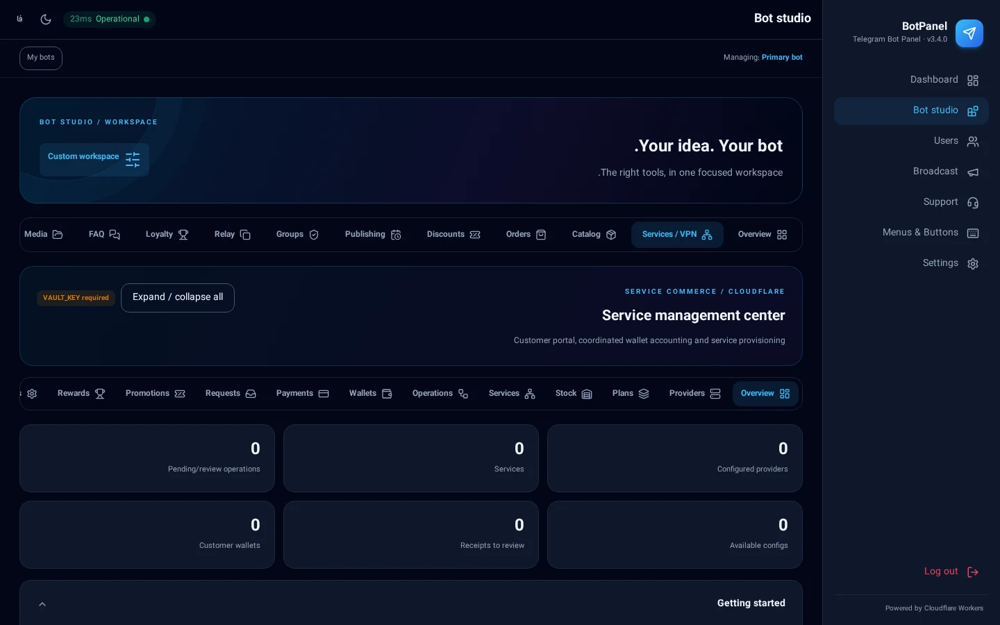
</div>

<details>
<summary><b>▸ نمای کلی و راه‌اندازی اولیه ماژول سرویس</b></summary>

<div dir="rtl">

این ماژول برای فروش سرویس (VPN، اشتراک، اکانت) ساخته شده و ۱۳ تب دارد. برای شروع:

1. مطمئن شوید `VAULT_KEY` در Secretها تنظیم شده است (بدون آن اطلاعات پنل‌ها ذخیره نمی‌شود).
2. در **کارگاه ربات ← نمای کلی**، نوع ربات را روی **سرویس / VPN** بگذارید یا در حالت سفارشی ماژول «سرویس» را تیک بزنید.
3. وارد **کارگاه ربات ← سرویس / VPN** شوید.

**بهینه‌سازی سرعت:** پوسته صفحه بلافاصله رسم می‌شود و محتوای هر تب پشت آن بارگذاری و برای مدت کوتاهی نگهداری (کش) می‌شود؛ جابه‌جایی بین تب‌ها بدون انتظار انجام می‌شود و با هر تغییر داده، کش خودکار پاک می‌شود.

</div>

</details>

<details>
<summary><b>▸ پنل‌ها (Providers)</b></summary>

<div dir="rtl">

1. **افزودن پنل** را بزنید و نوع را انتخاب کنید: Marzban، Marzneshin، **PasarGuard**، انبار دستی (Stock) و…
2. آدرس پنل، نام کاربری و رمز را وارد کنید. اطلاعات با `VAULT_KEY` رمزنگاری و ذخیره می‌شود و دیگر در API برگردانده نمی‌شود.
3. **تست اتصال** را بزنید؛ در صورت موفقیت، نسخه پنل نمایش داده می‌شود.
4. پنل را **فعال** کنید تا در ساخت پلن قابل انتخاب باشد.

**اتصال PasarGuard:** نوع پنل را `PasarGuard` انتخاب کنید و آدرس، نام کاربری و رمز ادمین پنل PasarGuard را وارد کنید (همان API استاندارد خانواده Marzban + گروه‌ها). اگر در ساخت پلن **گروه سرویس** انتخاب کنید، کاربر داخل همان گروه ساخته می‌شود.

</div>

</details>

<details>
<summary><b>▸ پلن‌ها</b></summary>

<div dir="rtl">

1. **پلن جدید** → عنوان، پنل مرتبط، مدت (روز)، حجم (گیگابایت)، قیمت.
2. **نقش‌های مجاز** را انتخاب کنید: مشتری عادی، نماینده، نماینده اعتباری.
3. قیمت خرید اضافه (هر گیگ اضافه / هر روز اضافه) را برای تمدید تعیین کنید.
4. اگر پلن از انبار تأمین می‌شود، **قفسه انبار** را انتخاب کنید.
5. پلن ذخیره‌شده بلافاصله در ربات و مینی‌اپ قابل خرید است.

</div>

</details>

<details>
<summary><b>▸ انبار (Stock)</b></summary>

<div dir="rtl">

برای فروش کانفیگ‌های آماده:

1. یک **قفسه** بسازید (مثلاً «آلمان ۳۰ روزه»).
2. با **ورود گروهی**، کانفیگ‌ها را خط‌به‌خط جای‌گذاری کنید.
3. موجودی به‌صورت زنده نمایش داده می‌شود؛ با هر فروش یک آیتم مصرف می‌شود.
4. هنگام کم شدن موجودی، در نمای کلی هشدار می‌گیرید.

</div>

</details>

<details>
<summary><b>▸ سرویس‌ها (اشتراک‌های فعال)</b></summary>

<div dir="rtl">

فهرست همه سرویس‌های فروخته‌شده با مالک، پلن، تاریخ انقضا و مصرف.

- **مشاهده:** لینک اشتراک، مصرف و وضعیت.
- **تمدید دستی:** افزودن روز یا حجم بدون پرداخت.
- **تعلیق/فعال‌سازی:** قطع موقت سرویس.
- **حذف:** فقط زمانی که در پنل مقصد هم حذف شده باشد.

</div>

</details>

<details>
<summary><b>▸ عملیات (Operations)</b></summary>

<div dir="rtl">

هر خرید، تمدید یا تغییر، یک «عملیات» می‌سازد. اگر ارتباط با پنل مقصد قطع شود، عملیات در حالت «نامطمئن» می‌ماند و سیستم خودکار **تطبیق (reconcile)** انجام می‌دهد تا سرویس تکراری ساخته نشود. از این تب می‌توانید عملیات ناتمام را دستی بررسی یا دوباره اجرا کنید.

</div>

</details>

<details>
<summary><b>▸ کیف پول</b></summary>

<div dir="rtl">

- موجودی هر کاربر، تاریخچه واریز و برداشت.
- **افزایش/کاهش دستی موجودی** با ثبت دلیل (برای پشتیبانی و جبران خسارت).
- سقف اعتبار برای نمایندگان اعتباری.

</div>

</details>

<details>
<summary><b>▸ پرداخت‌ها و درگاه‌ها</b></summary>

<div dir="rtl">

روش‌های پشتیبانی‌شده:

| روش | توضیح |
|------|--------|
| کارت‌به‌کارت | کاربر رسید می‌فرستد، مدیر تأیید می‌کند |
| زرین‌پال | پرداخت آنلاین ریالی |
| Telegram Stars | پرداخت داخل تلگرام |
| کریپتو (TON/TRON — USDT) | بررسی خودکار تراکنش |

برای هر درگاه، کلیدها را در همین تب وارد کنید؛ مقادیر حساس رمزنگاری ذخیره می‌شوند. تراکنش‌ها با وضعیت (در انتظار، تأییدشده، ناموفق) فهرست می‌شوند.

</div>

</details>

<details>
<summary><b>▸ درخواست‌ها</b></summary>

<div dir="rtl">

درخواست‌هایی که نیاز به تصمیم مدیر دارند: ارتقای نقش به نماینده، افزایش اعتبار، تعویض کانفیگ، بازگشت وجه. هر ردیف دو دکمه **تأیید** و **رد** دارد و نتیجه بلافاصله به کاربر اطلاع داده می‌شود.

</div>

</details>

<details>
<summary><b>▸ تخفیف و هدیه</b></summary>

<div dir="rtl">

کدهای تخفیف مخصوص سرویس، کد هدیه شارژ کیف پول و کمپین‌های معرفی دوست. برای هر کد: سقف استفاده، تاریخ انقضا و محدودیت پلن قابل تعریف است.

</div>

</details>

<details>
<summary><b>▸ گردونه و قرعه‌کشی</b></summary>

<div dir="rtl">

- **گردونه شانس:** جوایز و شانس هرکدام را تعیین کنید؛ بودجه روزانه و فاصله زمانی بین چرخش‌ها قابل تنظیم است.
- **قرعه‌کشی:** بلیت‌ها بر اساس خرید یا فعالیت جمع می‌شوند و در زمان مقرر برنده به‌صورت خودکار انتخاب و اعلام می‌شود.
- **تاس:** هدیه سریع با محدودیت «فقط کاربران بدون خرید قبلی» یا «فقط نقش خاص».

</div>

</details>

<details>
<summary><b>▸ تنظیمات سرویس</b></summary>

<div dir="rtl">

- **برند:** نام فارسی/انگلیسی فروشگاه، رنگ اصلی و لوگو (در مینی‌اپ دیده می‌شود).
- **قوانین:** متن قوانین و نسخه آن؛ با تغییر نسخه، کاربران دوباره باید بپذیرند.
- **شماره تماس:** الزام دریافت شماره و محدودسازی به شماره‌های ایران.
- **چت گزارش:** آیدی گروه یا کانالی که رویدادهای مهم (خرید، پیام پشتیبانی، خطا) به آن ارسال می‌شود.
- **حالت تعمیر:** توقف موقت خرید با نمایش پیام دلخواه.

</div>

</details>

<details>
<summary><b>▸ گزارش و پشتیبان</b></summary>

<div dir="rtl">

- خروجی **Excel/CSV** از فروش، سرویس‌ها، کیف پول‌ها و کاربران.
- **پشتیبان کامل** به‌صورت فایل رمزگذاری‌شده (با `BACKUP_PASSWORD`).
- **بازیابی** از فایل پشتیبان؛ پیش از بازیابی حتماً یک پشتیبان تازه بگیرید.

</div>

</details>

### ۶٫۹ ربات‌های من (چند ربات)

<details>
<summary><b>▸ مدیریت چند ربات از یک پنل</b></summary>

<div dir="rtl">

1. در بخش **ربات‌های من**، ربات جدید را با توکن آن اضافه کنید.
2. هر ربات فضای داده کاملاً مستقل (Durable Object جدا) می‌گیرد؛ کاربران، محصولات و تنظیمات با هم قاطی نمی‌شوند.
3. وب‌هوک هر ربات از همان صفحه ثبت می‌شود.
4. با انتخاب هر ربات، کل پنل به داده همان ربات سوئیچ می‌شود.
5. **منو و دکمه‌ها هم مختص همان ربات است:** پس از تغییر ربات انتخاب‌شده، بخش «منو و دکمه‌ها» (ویرایش متن/مقدار، جابجایی بین ردیف‌ها، افزودن و حذف دکمه) خودکار به دکمه‌های همان ربات سوئیچ می‌شود؛ کش نسخه قبلی دیده یا ذخیره نمی‌شود. این بخش از منوی «بیشتر» نسخه موبایل هم برای همه انواع ربات در دسترس است. مدیریت از خود تلگرام (`/admin` ← 🎛 دکمه‌ها و منو) هم به ربات انتخاب‌شده فعلی اعمال می‌شود.

</div>

</details>

---

## ۷. مینی‌اپ مدیریت ربات (Admin Mini App) و پرتال مشتری

<div align="center">
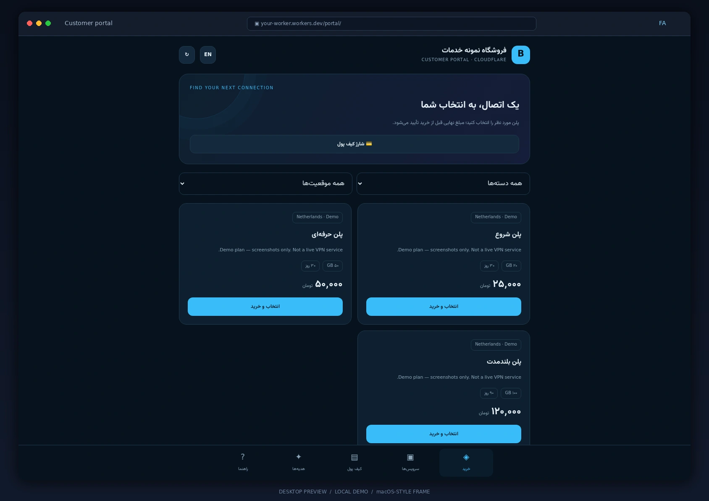
</div>

<details open>
<summary><b>▸ نشانی بخش‌های مینی‌اپ و نحوه اتصال آن‌ها به تلگرام</b></summary>

<div dir="rtl">

**۱) جدول نشانی‌ها** — به‌جای `<آدرس-پنل>` آدرس Worker خود را بگذارید (مثلاً `my-panel.workers.dev`):

| بخش | نشانی | کاربر |
|-----|-------|-------|
| 🛠 پنل مدیریت کامل (مینی‌اپ ادمین) | `https://<آدرس-پنل>/` | فقط ادمین |
| 🛠 پنل مدیریت ربات فرزند (چندربات) | همان آدرس بالا + انتخاب ربات از «ربات‌های من»؛ درخواست‌ها به‌صورت خودکار به `/api/bots/<BOT_ID>/admin/api/…` مسیریابی می‌شود | فقط ادمین |
| 🌐 پرتال/مینی‌اپ مشتری ربات اصلی | `https://<آدرس-پنل>/portal` | همه کاربران ربات |
| 🌐 پرتال مشتری هر ربات فرزند | `https://<آدرس-پنل>/bots/<BOT_ID>/portal` | کاربران همان ربات |
| 📡 لینک اشتراک تک‌سرویس | `https://<آدرس-پنل>/sub/<توکن>` | مشتری سرویس |
| 📡 اشتراک ترکیبی همه سرویس‌ها | `https://<آدرس-پنل>/sub-all/<توکن>` | مشتری سرویس |
| 💳 بازگشت درگاه پرداخت | `https://<آدرس-پنل>/pay/…` (خودکار) | — |
| 📰 بخش خبر داخل ربات | دکمه «📰 خبر» (اخبار ایران / خبر جهانی + دسته‌ها) یا دستور `/news` | همه کاربران |
| 📈 بخش قیمت داخل ربات | دکمه «📈 قیمت دلار و طلا و تتر» یا دستورات `/rates`, `/price`, `/gold` | همه کاربران |

**۲) اتصال به تلگرام، گام‌به‌گام:**

1. **ثبت توکن:** در پنل ← **تنظیمات ← تنظیمات ربات**، توکن BotFather را ذخیره و «آزمایش اتصال» را بزنید تا یوزرنیم ربات ثبت شود.
2. **ثبت وب‌هوک:** در همان صفحه **«تنظیم وب‌هوک»** را بزنید. آدرس وب‌هوک `https://<آدرس-پنل>/telegram/webhook` است و secret آن به‌صورت خودکار تنظیم می‌شود. برای هر ربات فرزند، از **«ربات‌های من» ← دکمه «وب‌هوک»** استفاده کنید (آدرس: `https://<آدرس-پنل>/bots/<BOT_ID>/telegram/webhook`).
3. **ورود بدون رمز ادمین در تلگرام:** آیدی عددی خود (با `/id`) را در **تنظیمات ← آیدی عددی ادمین** ذخیره کنید. سپس دکمه **«🛠 پنل مدیریت (مینی‌اپ)»** در `/start` ادمین و در خروجی `/admin` ظاهر می‌شود؛ با لمس آن، هویت شما با `Telegram.WebApp.initData` (HMAC-SHA256) تأیید و پنل باز می‌شود.
4. **دکمه Menu Button در BotFather (اختیاری):** در BotFather دستور `/setmenubutton` ← انتخاب ربات ← ارسال آدرس مینی‌اپ:
   - برای ادمین: `https://<آدرس-پنل>/`
   - برای مشتریان: `https://<آدرس-پنل>/portal` (یا آدرس `/bots/<BOT_ID>/portal` ربات فرزند)
   - یا از `/newapp` برای ساخت Web App در یک دستور استفاده کنید.
5. **نیازمندی‌ها:** آدرس باید HTTPS عمومی باشد؛ در Cloudflare، متغیر `WEBHOOK_SECRET` تنظیم شده باشد (در استقرار استاندارد خودکار است) و ربات برای قابلیت‌های کانال/گروه، ادمین آن چت‌ها باشد.

</div>

</details>

<details>
<summary><b>▸ مدیریت کامل از خود تلگرام (بدون پنل وب) — اخبار، قیمت، حذف فوروارد و دکمه‌ها</b></summary>

<div dir="rtl">

ادمین با ارسال `/admin` (یا `/panel`) در پی‌وی ربات به یک پنل شیشه‌ای کامل دسترسی دارد که **همه امکانات پنل وب را هم پوشش می‌دهد**:

| دکمه | امکانات |
|------|---------|
| 📰 **مدیریت اخبار** | ارسال فوری هر دسته (اخبار ایران / خبر جهانی: فوری، سیاسی، اقتصادی، ورزشی، فناوری یا ترکیب همه) به کانال/گروه‌های ثبت‌شده؛ روشن/خاموش کردن ارسال خودکار؛ انتخاب دسته، **ساعت روزانه** (تهران) یا فاصله زمان‌بندی؛ ثبت/ویرایش مقصدها |
| 📈 **مدیریت قیمت** | ارسال فوری جدول قیمت لحظه‌ای (طلا / ارز / کریپتو / همه) با پیش‌نمایش؛ روشن/خاموش کردن ارسال خودکار روزانه، انتخاب نوع ارز و ساعت روزانه (تهران)؛ ثبت/ویرایش مقصدها |
| 🪄 **حذف فوروارد** | فهرست پیام‌ها و فایل‌های دریافتی؛ با هر فایل، ربات **از ادمین می‌پرسد**: «انتشار در مقصدها؟» — با تأیید، پیام با `copyMessage` و **بدون برچسب فوروارد** به کانال/گروه می‌رود؛ رد پیام؛ تغییر مقصدها؛ خاموش/روشن کردن تأیید مدیر و دریافت پیام |
| 🎛 **دکمه‌ها و منو** | ویرایشگر کامل دکمه‌های صفحه اصلی: **افزودن دکمه جدید** (متن ← نوع ← مقدار)، **تغییر متن و مقدار**، **جابجایی** (عقب/جلو در ردیف، انتقال به ردیف بالا/پایین) و **حذف** — دقیقاً همان کاری که در پنل وب انجام می‌شود |
| 📊 / 📦 | آمار ربات و آخرین سفارش‌ها |
| 🚀 | باز کردن پنل وب (مینی‌اپ) |

**ویرایش در محل (نسخه ۳٫۴):** با لمس هر دکمه، **همان پیام ویرایش می‌شود** و گزینه‌های بعدی در همان‌جا ظاهر می‌شوند؛ صفحه‌های مدیریت به‌عنوان پیام جدید به چت اضافه نمی‌شوند. فقط نتایج نهایی (مثلاً ارسال فوری به مقصدها) پیام جدید می‌گیرند.

این کنترل‌ها فقط برای آیدی ثبت‌شده در «آیدی عددی ادمین» فعال‌اند و قبل از قفل عضویت بررسی می‌شوند تا ادمین همیشه بتواند تصمیم بگیرد.

</div>

</details>

<details open>
<summary><b>▸ مینی‌اپ مدیریت ربات برای ادمین (Admin Mini App داخل تلگرام)</b></summary>

<div dir="rtl">

با این قابلیت، مدیر ربات می‌تواند **تمام بخش‌های پنل مدیریت را مستقیماً داخل اپلیکیشن تلگرام** بدون نیاز به باز کردن مرورگر جداگانه یا تایپ رمز عبور مدیریت کند!

**نحوه راه‌اندازی و اتصال گام‌به‌گام:**

1. **دریافت آیدی عددی تلگرام:** در پی‌وی ربات دستور `/id` را ارسال کنید و آیدی عددی خود (مثلاً `123456789`) را کپی کنید.
2. **ثبت آیدی ادمین در پنل:** وارد **تنظیمات ← تنظیمات ربات** شوید و آیدی عددی را در فیلد **«آیدی عددی ادمین»** وارد کرده و دکمه ذخیره را بزنید.
3. **تنظیم وب‌هوک و آدرس پنل:** در بخش **مدیریت وب‌هوک**، وب‌هوک را ثبت کنید تا آدرس عمومی پنل فعال شود.
4. **ورود مستقیم به پنل از داخل تلگرام:**
   - با ارسال دستور `/admin` یا `/panel` به ربات، دکمه **«🚀 باز کردن پنل مدیریت (مینی‌اپ)»** ظاهر می‌شود.
   - همچنین برای ادمین، دکمه شیشه‌ای **«🛠 پنل مدیریت (مینی‌اپ)»** به‌صورت اختصاصی در بالای منوی شروع (`/start`) نمایش داده می‌شود.
5. **احراز هویت ایمن بدون رمز:** تلگرام با استفاده از توکن امنیتی استاندارد `Telegram.WebApp.initData` و الگوریتم HMAC-SHA256 هویت ادمین را فوراً تأیید می‌کند و پنل مدیریت با تمام امکانات در پنجره بازشو مینی‌اپ بارگذاری می‌شود.

</div>

</details>

<details>
<summary><b>▸ پرتال و مینی‌اپ مشتری (فروشگاه و خدمات)</b></summary>

<div dir="rtl">

مینی‌اپ مشتری، نسخه گرافیکی و فروشگاهی داخل تلگرام برای کاربران عادی است؛ آدرس آن `https://<آدرس Worker>/portal` است.

**فعال‌سازی:**

1. در **سرویس ← تنظیمات**، مقدار «آدرس عمومی» را با آدرس Worker پر کنید.
2. در BotFather دستور `/setmenubutton` را بزنید و همان آدرس `/portal` را ثبت کنید، یا در منوی ربات دکمه‌ای از نوع WebApp بسازید.
3. کاربر با لمس دکمه، بدون خروج از تلگرام وارد فروشگاه می‌شود؛ ورود او با `initData` تلگرام تأیید می‌شود و رمز جداگانه‌ای لازم نیست.

**تب‌های مینی‌اپ مشتری:**
| تب | کاربرد |
|-----|--------|
| خانه | خلاصه حساب، موجودی، سرویس‌های فعال |
| فروشگاه | خرید پلن جدید، اعمال کد تخفیف |
| سرویس‌های من | لینک اشتراک، مصرف، تمدید |
| کیف پول | شارژ، تاریخچه تراکنش |
| جوایز | گردونه، قرعه‌کشی، امتیاز |
| راهنما و پشتیبانی | راهنمای متنی + گفتگوی زنده با پشتیبانی |

</div>

</details>

<details>
<summary><b>▸ گفتگوی پشتیبانی داخل مینی‌اپ (بازطراحی‌شده)</b></summary>

<div dir="rtl">

قبلاً دکمه پشتیبانی فقط کاربر را از مینی‌اپ بیرون می‌برد و به چت ربات می‌فرستاد. حالا:

1. کاربر وارد تب **راهنما ← گفتگو با پشتیبانی** می‌شود و کل تاریخچه گفتگو را می‌بیند.
2. پیام خود را در همان صفحه می‌نویسد و ارسال می‌کند (حداکثر ۲۰۰۰ کاراکتر، با محدودیت ۱۰ پیام در دقیقه برای جلوگیری از اسپم).
3. پیام بلافاصله در **پنل ← پشتیبانی** ثبت می‌شود و در صورت تنظیم «چت گزارش»، برای مدیران هم اعلان می‌رود.
4. پاسخ مدیر **هم در همین گفتگو** و **هم به‌صورت پیام تلگرام** به کاربر می‌رسد.
5. تعداد پاسخ‌های خوانده‌نشده به‌صورت نشان قرمز روی تب راهنما نمایش داده می‌شود و با باز کردن گفتگو صفر می‌شود.
6. صفحه هر ۱۲ ثانیه به‌روزرسانی می‌شود، پس پاسخ مدیر بدون رفرش دستی ظاهر می‌شود.

اگر ماژول پشتیبانی خاموش باشد، پیام «پشتیبانی فعال نیست» نمایش داده می‌شود.

</div>

</details>

---

## ۸. ربات از نگاه کاربر

<details>
<summary><b>▸ جدول دستورها، امکانات و رفتار دکمه‌ها</b></summary>

<div dir="rtl">

### فهرست کامل دستورات ربات:

| دستور | بخش / کاربرد | توضیحات |
|-------|--------------|---------|
| `/start` | عمومی | پیام خوش‌آمد و منوی اصلی ربات |
| `/help` | عمومی | راهنمای استفاده و فهرست دستورها |
| `/lang` | عمومی | انتخاب زبان فارسی / انگلیسی |
| `/id` | عمومی | نمایش شناسه عددی تلگرام کاربر |
| `/ping` | عمومی | آزمایش آنلاین بودن و پاسخگویی ربات |
| `/admin` یا `/panel` | مدیریت | پنل مدیریت شیشه‌ای کامل داخل تلگرام برای ادمین: همه بخش‌های پنل با **ویرایش در محل** (بدون پیام جدید) + دکمه مینی‌اپ |
| `/search <عبارت>` | فروشگاه | جستجوی آنی در کاتالوگ محصولات |
| `/catalog` یا `/shop` | فروشگاه | مشاهده کاتالوگ و دسته‌بندی محصولات |
| `/cart` | فروشگاه | مشاهده و مدیریت سبد خرید |
| `/orders` | فروشگاه | تاریخچه و پیگیری سفارش‌های ثبت‌شده |
| `/rates`, `/price`, `/gold`, `/dollar`, `/arz` | بازار و قیمت | نرخ لحظه‌ای طلا، دلار، تتر، سکه و رمزارزها؛ ورود با یک دکمه + زمان‌بندی انتشار |
| `/news` یا `/khabar` | اخبار | پایگاه خبر کل کشور: اخبار ایران و خبرهای جهانی (فارسی) با دسته‌بندی و زمان‌بندی |
| `/points` یا `/ref` | باشگاه اعضا | امتیازها، لینک دعوت اختصاصی و رتبه |
| `/progress` | آموزش | مشاهده وضعیت دروس و دوره‌های گذرانده‌شده |
| `/faq` | راهنما | فهرست پرسش‌ها و پاسخ‌های پرتکرار |
| `/cancel` یا `/end` | پشتیبانی | بستن گفتگوی پشتیبانی یا لغو عملیات جاری |

### دستورات مدیریتی گروه (ارسال در گروه):
| دستور | عملکرد |
|-------|--------|
| `/lock` و `/unlock` | قفل کامل چت گروه یا بازگشایی آن |
| `/clean <تعداد>` | حذف گروهی پیام‌های اخیر گروه (مثلاً `/clean 20`) |
| `/raffle <تعداد برنده>` | ساخت مسابقه و قرعه‌کشی شیشه‌ای در گروه |
| `/ban` و `/unban` | مسدودسازی و اخراج کاربر متخلف (با ریپلای روی پیام) |
| `/mute 2h` و `/unmute` | بی‌صدا کردن موقت کاربر متخلف برای مدت مشخص |
| `/warn`, `/unwarn`, `/warns` | مدیریت اخطارهای کاربر (ثبت، کسر و استعلام) |
| `/rules` | نمایش قوانین رسمی و مقررات گروه |
| `/link` | دریافت لینک رسمی دعوت به گروه |
| `/report` | گزارش تخلف پیام با ریپلای برای مدیران گروه |

**دکمه‌های ناوبری یکپارچه (🔙 بازگشت):**
در تمام بخش‌های ربات، زیرمنوها، مراحل سبد خرید، کاتالوگ و نمایش قیمت‌ها، دکمه‌های «🔙 بازگشت» و «🔙 منوی اصلی» تعبیه شده تا کاربر هرگز در منوها سردرگم نشود.

**رفتار دکمه‌ها:**
- زدن هر دکمه شیشه‌ای، **همان پیام باز را ویرایش می‌کند** تا محیط چت تمیز و منظم بماند.
- محتوای ارسالی فاکتورها، فایل‌های دانلودی و رسیدها برای نگهداری در تاریخچه به‌صورت پیام جدید ارسال می‌شوند.

</div>

</details>

---

## ۹. پشتیبان‌گیری، گزارش و امنیت

<details>
<summary><b>▸ کارهایی که باید مرتب انجام دهید</b></summary>

<div dir="rtl">

| کار | دوره | مسیر |
|-----|------|------|
| پشتیبان کامل | هفتگی | سرویس ← گزارش و پشتیبان |
| خروجی Excel فروش | ماهانه | سرویس ← گزارش و پشتیبان |
| بررسی وضعیت وب‌هوک | ماهانه | تنظیمات ← مدیریت وب‌هوک |
| تغییر رمز پنل | دوره‌ای | تنظیمات ← امنیت |
| بررسی گزارش خطا | هفتگی | `npx wrangler tail` |

**نکات امنیتی:**

- رمز پیش‌فرض را همان روز اول عوض کنید.
- توکن ربات و کلیدهای درگاه را هرگز کامیت نکنید.
- چت ذخیره‌سازی رسانه را خصوصی نگه دارید.
- `VAULT_KEY` را عوض نکنید مگر با برنامه مهاجرت؛ با تغییر آن، اطلاعات رمزنگاری‌شده قبلی قابل خواندن نیست.

</div>

</details>

---

## ۱۰. توسعه و تست

<details>
<summary><b>▸ دستورهای مفید برای توسعه‌دهنده</b></summary>

<div dir="rtl">

```bash
npm ci                 # نصب دقیق وابستگی‌ها
npm run build          # ساخت CSS و دارایی‌های ثابت
npm run dev            # اجرای محلی روی 127.0.0.1:8787
npm test               # تست‌های واحد و یکپارچه
npm run test:ui        # تست مرورگری پنل (نیازمند Playwright)
npm run deploy         # استقرار روی Cloudflare
npx wrangler tail      # مشاهده لاگ زنده
```

**ساختار پوشه‌ها:**

```
src/
  index.js         مسیرهای API و Durable Object
  telegram.js      منطق ربات (پیام‌ها، دکمه‌ها، ویرایش پیام)
  bot-api.js       ارتباط با API تلگرام
  kv.js            مدل داده و تیکت‌ها
  routes/          مسیرهای پنل (کاربران، پشتیبانی، تنظیمات…)
  services/        ماژول سرویس/VPN و مینی‌اپ
public/
  index.html       پوسته پنل
  panel.js         هسته رابط کاربری
  studio.js        کارگاه ربات
  services.js      مدیریت سرویس
  portal/          مینی‌اپ مشتری
tests/             تست‌ها
```

</div>

</details>

---

## ۱۱. گالری تصاویر

<details open>
<summary><b>▸ نمای بخش‌های مختلف</b></summary>

<div align="center">

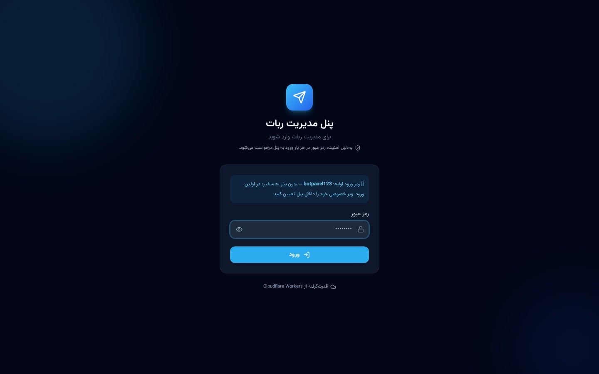
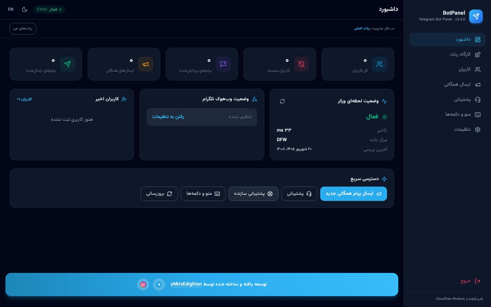
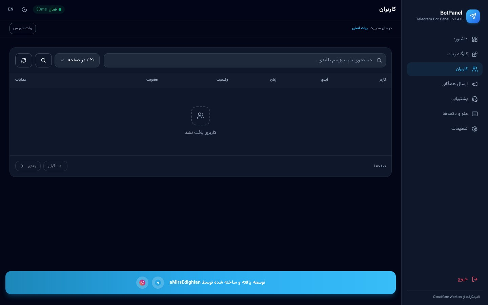
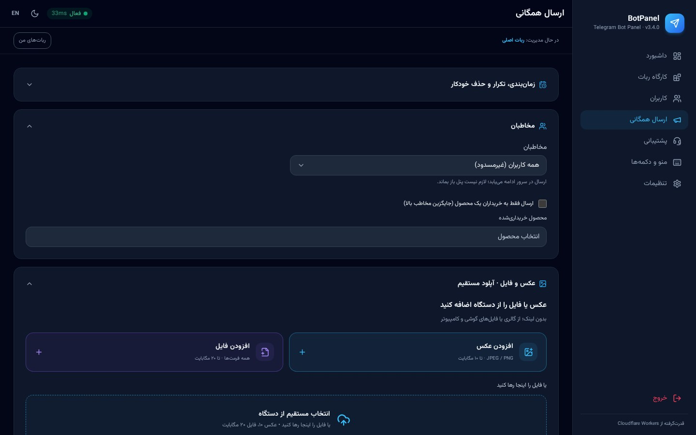
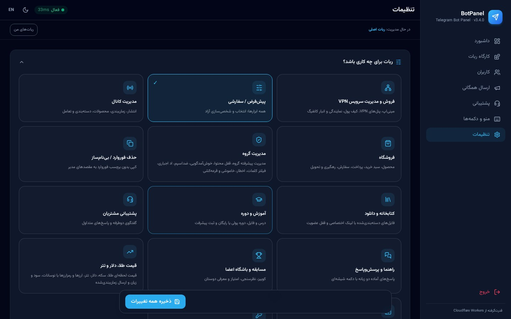


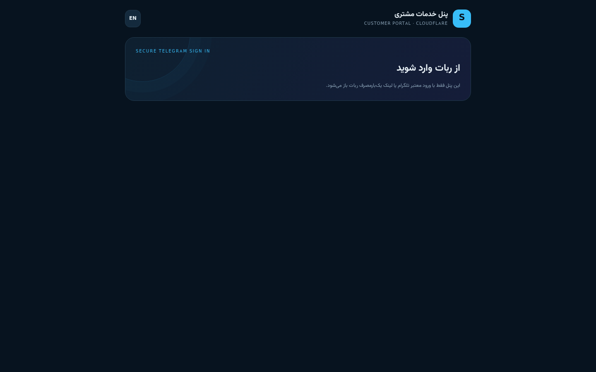
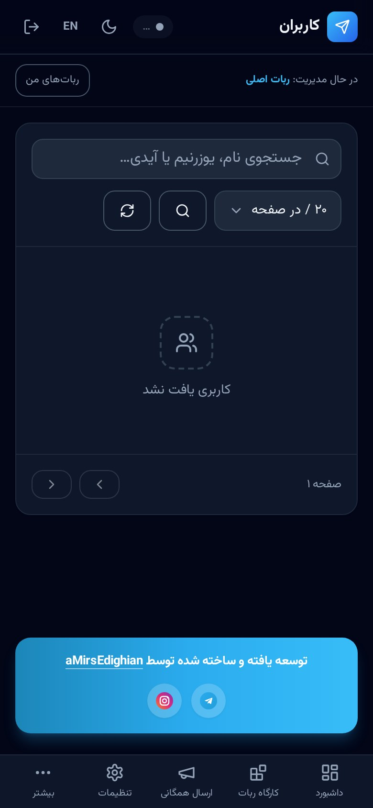

</div>

> 📸 تصاویر این بخش با دستور `npm run screenshots` از آخرین نسخه‌ی پنل گرفته می‌شوند؛ بعد از هر دست‌کاری، همان دستور کافی است تا همه‌ی تصاویر دوباره ساخته شوند.

</details>

---

## ۱۲. عیب‌یابی

<details>
<summary><b>▸ خطاهای رایج و راه‌حل</b></summary>

<div dir="rtl">

| مشکل | علت محتمل | راه‌حل |
|-------|-----------|--------|
| ربات پاسخ نمی‌دهد | وب‌هوک ثبت نشده | تنظیمات ← مدیریت وب‌هوک ← ثبت وب‌هوک |
| خطای 401 در پنل | نشست منقضی | خروج و ورود دوباره |
| «توکن نامعتبر» | توکن اشتباه یا لغو شده | توکن را از BotFather بگیرید و دوباره ثبت کنید |
| آپلود فایل ناموفق | چت ذخیره‌سازی تنظیم نشده | تنظیمات ← فایل و رسانه |
| عضویت کانال بررسی نمی‌شود | ربات ادمین کانال نیست | ربات را ادمین کنید |
| ارسال همگانی کند است | محدودیت نرخ تلگرام | اندازه دسته را کم و فاصله را زیاد کنید |
| اطلاعات پنل VPN ذخیره نمی‌شود | `VAULT_KEY` تنظیم نشده | Secret را اضافه و دوباره Deploy کنید |
| مینی‌اپ باز نمی‌شود | آدرس عمومی خالی است | سرویس ← تنظیمات ← آدرس عمومی |
| پیام پشتیبانی ثبت نمی‌شود | ماژول پشتیبانی خاموش است | نوع ربات یا ماژول‌های سفارشی را بررسی کنید |

برای دیدن خطای دقیق سمت سرور:

```bash
npx wrangler tail
```

</div>

</details>

---

## ۱۳. سازنده و راه‌های ارتباط

<div align="center">


### ساخته و پشتیبانی‌شده توسط **aMirsEdighian**

برای ارتباط، پشتیبانی، سفارش توسعه یا گزارش مشکل، روی لوگوها بزنید:

<a href="https://t.me/developer_as"></a>
&nbsp;&nbsp;
<a href="https://instagram.com/x.amirrezaa1"></a>

| کانال ارتباطی | آیدی | لینک |
|----------------|------|------|
| تلگرام | `developer_as` | [t.me/developer_as](https://t.me/developer_as) |
| اینستاگرام | `x.amirrezaa1` | [instagram.com/x.amirrezaa1](https://instagram.com/x.amirrezaa1) |

<a href="README.en.md"></a>

</div>
