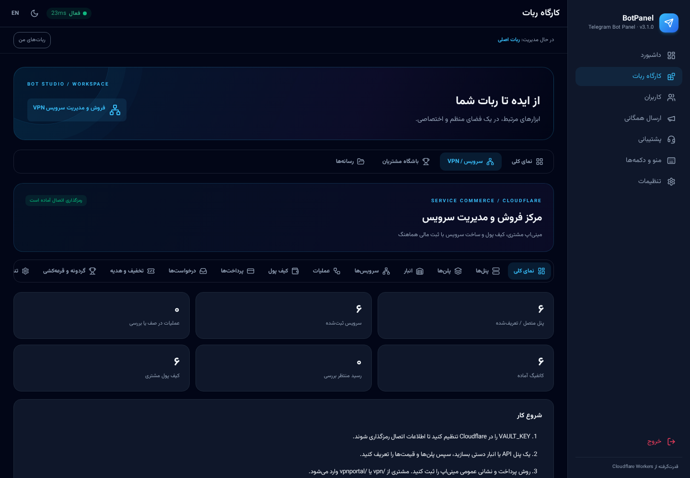

# BotPanel v2 — کارگاه ساخت ربات تلگرام

پنل فارسی/انگلیسی با **یک ربات اصلی و ربات‌های مستقلِ مدیریت‌شده**، با ۱۳ حالت کاری و ابزارهای اختصاصی کانال، فروشگاه، گروه، حذف فوروارد و محتوای آموزشی.

**مخزن v2:** https://github.com/amirsedighian071-stack/telegram-bot-panel-v2

- [راهنمای کامل قابلیت‌ها و محدودیت‌ها](V2_GUIDE.fa.md)
- [راه‌اندازی و استقرار روی Cloudflare](DEPLOY.fa.md)


## نسخه ۳٫۱ — ورود اولیه بدون متغیر

**رمز اولیه: `botpanel123`** — در نصب تازه به `ADMIN_PASSWORD` یا `ALLOW_DEFAULT_PASSWORD` نیاز نیست. پس از ورود، رمز خصوصی را در فرم خود پنل انتخاب کنید. تا آن زمان، نشست اولیه به اطلاعات مالی و توکن‌ها دسترسی ندارد. رمز خصوصی قبلی بازنشانی نمی‌شود.

در این نسخه، اتصال TetraPay/IRanpay 1 (نام تنظیم قدیمی FloyPay)، Factor/IRanpay 3، نرخ‌گیری خودکار از منبع مرجع، تاس/اسلات رایگان تلگرام و گزارش مالی روزانه اضافه شده‌اند.

**[راهنمای نسخه ۳٫۱ و مرز قابلیت‌ها](docs/RELEASE-3.1.fa.md)**

## نسخه ۳ — خدمات و مینی‌اپ مشتری

بر اساس بررسی قابلیت‌های [Faoxima](https://github.com/Mmd-Amir/Faoxima)، یک ماژول **بومی Cloudflare Workers** اضافه شده است؛ PHP/MySQL پروژه مرجع کپی نشده‌اند.

- پنل‌های Marzban/Marzneshin، انواع x-ui/Alireza، S-UI، Hiddify، WGDashboard، MikroTik، IBSng، Guard و انبار دستی، با قراردادهای مشخص API.
- مینی‌اپ فارسی/انگلیسی، کیف پول با ثبت تراکنشی، نمایندگی اعتباری، قیمت سفارشی، تست، خرید چندتایی و انبار کانفیگ مستقل.
- ساخت، تمدید، حجم/زمان اضافه، درخواست انتقال/تغییر موقعیت/استرداد و تطبیق نتایج نامشخص بدون کسر یا ساخت تکراری.
- فیش دستی، زرین‌پال، آقای پرداخت، زرین‌پی، NOWPayments، Plisio، Stars و استعلام TRON/TON با Memo فاکتور.
- کد هدیه/تخفیف، کش‌بک و پورسانت، گردونه/قرعه‌کشی، QR و کارت مصرف، لینک تجمیعی، خروجی Excel/CSV و پشتیبان رمزگذاری‌شده.
- «ربات‌های من» برای چند ربات با توکن، وب‌هوک و SQLite جدا؛ زمینهٔ ربات جاری بالای پنل مشخص است.

**[راهنمای نسخه ۳، پیش‌نیازها، جدول سازگاری و موارد باقی‌مانده](docs/FAOXIMA-CLOUDFLARE.fa.md)**

این نسخه **برابری صددرصد با همه گزینه‌های قدیمی Faoxima نیست**. اتصال‌های TetraPay و Factor و نرخ‌گیری خودکار در ۳٫۱ اضافه شده‌اند. IRanpay 2/Tronado، بعضی ووچرهای قدیمی و برخی گردش‌های جانبی هنوز معادل کامل و تأییدشده ندارند. اتصال زنده به حساب‌ها و پنل‌های شما، بدون تنظیم آدرس و اعتبارنامه آنها قابل تأیید نیست.

برای اطلاعات اتصال خدمات، secret جدید `VAULT_KEY` لازم است. برای R2 شبانه، `BACKUPS` و `BACKUP_PASSWORD` اختیاری‌اند. راهنمای بالا را قبل از استفاده مالی بخوانید.



[نمای مینی‌اپ مشتری با داده آزمایشی](assets/screens/v3-customer-portal-fa.png)

## تازه‌های نسخه ۲

- **آپلود مستقیم با دو دکمه «افزودن عکس» و «افزودن فایل»**، کشیدن و رهاکردن، پیشرفت آپلود و استفاده مجدد از فایل‌های تلگرام؛ بدون نیاز به لینک عمومی.
- تنظیم «**ربات برای چه کاری باشد؟**»: خدمات VPN، سفارشی، کانال، فروشگاه، گروه، بی‌نام‌ساز، کتابخانه، آموزش، پشتیبانی، FAQ، مسابقه، خبرخوان و باشگاه محتوای قفل‌دار.
- مخفی‌کردن ابزارهای نامرتبط و تغییر واقعی رفتار ربات بر اساس نوع انتخاب‌شده، بدون پاک‌کردن اطلاعات قبلی.
- قفل عضویت چند کانال/گروه، عمومی یا مخصوص هر نوع ربات؛ خطای تلگرام دسترسی را باز نمی‌کند.
- محصولات، دسته‌بندی با دکمه شیشه‌ای، دیپ‌لینک ثابت، سبد خرید، تخفیف، موجودی رزروشده و تحویل دستی/آماده/فیزیکی.
- پرداخت کارت‌به‌کارت با **بررسی دستی فیش**؛ اتصال اختیاری زرین‌پال با تأیید سرور، نه اعتماد به لینک بازگشت.
- ارسال زمان‌بندی‌شده، تکرار، حذف خودکار و ادامه ارسال در سرور حتی با بسته‌بودن پنل.
- RSS/Atom، اعلان ویدیوهای یوتیوب و بازنشر کانال‌های در دسترس ربات.
- نظرسنجی تک/چندگزینه‌ای، کوییز، محدودیت عضویت، لایک/دیس‌لایک و بازخورد متنی.
- ضداسپم، فیلتر کلمه و رسانه، کپچا، پذیرش قوانین، اخطار، سکوت، گزارش و حالت شب برای چند گروه.
- کپی پیام/آلبوم بدون برچسب فوروارد، با مقصدهای انتخابی و تأیید اختیاری مدیر.
- امتیاز خرید/ثبت‌نام/معرفی، هدف‌گیری خریداران محصول و ثبت پیشرفت درس‌ها.
- انیمیشن سبک، ۶ تم، حالت کاهش حرکت و فایل‌های CSS/آیکون/فونت **محلی؛ بدون CDN زمان اجرا**.

## معماری

`Cloudflare Worker + Hono + Durable Objects SQLite + Telegram Bot API`

نسخه ۲ برای اطلاعات قابل تغییر از SQLite در Durable Object استفاده می‌کند. موجودی، رزرو تخفیف، امتیاز و ثبت سفارش با تراکنش هماهنگ می‌شوند. هر گروه صف جدا دارد تا کندی ارسال همگانی، همه گروه‌ها را پشت یک صف نگه ندارد.

`BOT_KV` قدیمی فقط برای **ورود اطلاعات قبلی به‌صورت خواندنی** استفاده می‌شود. داده‌های v2 به KV قدیمی نوشته نمی‌شوند؛ نشست‌های قبلی وارد نمی‌شوند و ارسال‌های ناتمام قدیمی با وضعیت متوقف/نیازمند بررسی وارد می‌شوند.

## راه‌اندازی سریع توسعه

Node.js **22.16+** لازم است.

```bash
npm ci
cp .dev.vars.example .dev.vars
npm run dev
```

در نصب تازه با `botpanel123` وارد شوید و سپس از فرم داخلی رمز خصوصی تعیین کنید. متغیر ورود لازم نیست؛ `ADMIN_PASSWORD` اختیاری است. اگر قبلاً رمز خصوصی ذخیره شده باشد، همان معتبر خواهد بود.

```bash
npm test
npm run smoke
npm run build
```

آزمایش مرورگر، روی Worker محلی جداگانه:

```bash
npx playwright install --with-deps chromium
# ترمینال اول: npm run dev
# ترمینال دوم:
npm run test:ui
```

این تست مرورگر داده آزمایشی ایجاد می‌کند؛ روی استقرار واقعی اجرا نشود. ارتباط‌های تلگرام و درگاه در تست‌های خودکار شبیه‌سازی شده‌اند و جای آزمایش پرداخت/ربات واقعی را نمی‌گیرند.

## پیش‌نیازهای اتصال واقعی

- دسترسی Cloudflare برای استقرار Worker، binding و migration مربوط به Durable Object.
- توکن BotFather، secret وب‌هوک، مجوزهای لازم ربات در مقصدها و چت موقت آپلود.
- برای زرین‌پال: merchant و نشانی عمومی Worker.
- برای تبدیل/فشرده‌سازی/واترمارک **ویدیو**: سرویس پردازش خارجی با قرارداد مستند در راهنما. این مخزن **خود سرویس FFmpeg یا زیرساخت آن را راه‌اندازی نمی‌کند**.

**مرز قابلیت‌ها:** واترمارک عکس‌های آپلود پنل در مرورگر اجرا می‌شود. فیش بانکی تصویری خودکار معتبر شناخته نمی‌شود. درگاه‌های اضافه و رمزارزها در ماژول خدمات نسخه ۳ ارائه شده‌اند، نه در گردش فروشگاه عمومی v2؛ تشخیص قطعی اکانت مخرب و تضمین بدون‌قطعی ارائه نشده‌اند.

## بهبودهای رابط در ۲٫۰٫۱

- عکس و فایل در ابتدای فرم ارسال قرار دارد؛ گزینه‌های پیشرفته اختیاری و جمع‌شونده‌اند.
- انتخاب نوع ربات، پیش‌نمایش ابزارهای مربوطه را نشان می‌دهد؛ انتخاب کارت، همه کارت‌ها را دوباره انیمیت نمی‌کند.
- انیمیشن کوتاه انتخاب و نورگذر دکمه‌های آپلود، با رعایت کاهش حرکت دستگاه.
- فایل‌های CSS/JS شماره نسخه دارند تا بعد از استقرار، مرورگر نسخه قدیمی را نگه ندارد.

## نمای پنل


[نمای موبایل](assets/screens/v2-settings-fa-mobile.png)

---

### English

A bilingual Telegram bot workspace with 13 purpose presets, direct media uploads, catalog/checkout, manually reviewed bank receipts, optional server-verified Zarinpal payments, durable scheduling, RSS/Atom publishing, group moderation, clean-copy relaying, loyalty and learning progress.

One deployment supports a primary bot and isolated managed bots. Cloudflare Durable Objects provide coordinated SQLite state; the legacy KV binding is read-only for migration. Production credentials, deployment and external media processing are separate setup steps. See the Persian guides above for exact capabilities, limits, environment variables and integration contracts.
